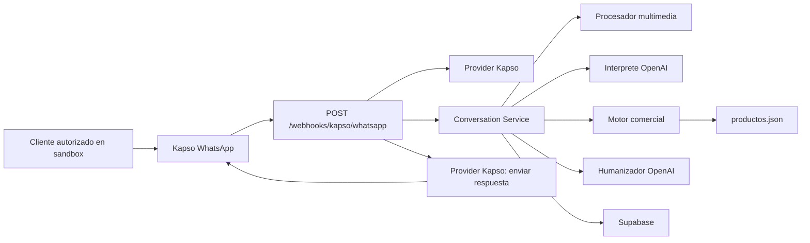

# Distrifinca WhatsApp IA

Backend conversacional para atender clientes de una tienda de mascotas por WhatsApp. El agente entiende lenguaje informal, consulta un catalogo controlado por el backend, arma pedidos y conserva el contexto de cada cliente.

El proyecto esta migrando de Twilio a Kapso. La integracion activa recibe JSON de Kapso y esta pensada para probarse primero con el sandbox antes de conectar el numero comercial.

## Estado actual

- Proveedor de WhatsApp activo: Kapso.
- Entorno recomendado mientras se valida la migracion: sandbox de Kapso.
- Persistencia: Supabase por REST API, con memoria local como respaldo para desarrollo.
- Catalogo: `productos.json`.
- IA: OpenAI para interpretar mensajes, humanizar respuestas, analizar imagenes y transcribir voz.
- Pruebas automatizadas: `npm test`.

## Capacidades principales

- Comprende saludos, pedidos, consultas de precio, cotizaciones y recomendaciones.
- Distingue entre consultar un precio y agregar un producto al carrito.
- Procesa varios productos enviados en el mismo mensaje.
- Conserva contexto entre mensajes cortos como `de 4kl`, `asi esta bien` o `agrega los dos`.
- Interpreta abreviaturas, errores de escritura y razas de mascotas sin programar una lista raza por raza.
- Valida marcas, referencias, presentaciones y precios contra el catalogo.
- Rechaza presentaciones inexistentes y ofrece alternativas reales.
- Gestiona carrito, cantidades, eliminaciones, entrega, datos del cliente y metodo de pago.
- Recibe imagenes por URL de Kapso para analizarlas con vision.
- Transcribe audios reales con OpenAI Whisper cuando Kapso entrega URL descargable; usa transcript de Kapso solo como respaldo.
- Guarda conversaciones, mensajes, pedidos confirmados y ejemplos curados en Supabase.

## Arquitectura



La mensajeria esta aislada en `src/providers/kapsoMessagingProvider.js`. La logica comercial y la persistencia no dependen del proveedor de WhatsApp.

Los mensajes consecutivos del mismo cliente se agrupan antes de llamar al agente. Cada mensaje reinicia la espera para recopilar el turno completo. La ventana local se configura con `INBOUND_MESSAGE_BUFFER_MS`; el valor recomendado para WhatsApp es `5000`.

## Inicio rapido

Requisitos:

- Node.js 20.19 o superior.
- Un proyecto de Supabase.
- Una API key de OpenAI.
- Un proyecto y sandbox de Kapso.

Instala dependencias:

```bash
npm install
```

Crea tu archivo local de configuracion:

```bash
cp .env.example .env
```

Completa las variables, ejecuta el esquema de Supabase y arranca el servidor:

```bash
npm start
```

El backend expone:

```text
GET  /health
POST /webhooks/kapso/whatsapp
```

Para configurar el sandbox paso a paso consulta [docs/kapso-migration.md](docs/kapso-migration.md).

## Verificacion

Ejecuta la suite:

```bash
npm test
```

Comprueba el servidor:

```bash
curl http://localhost:3000/health
```

Respuesta esperada:

```json
{ "ok": true, "provider": "kapso" }
```

## Documentacion

- [Contexto tecnico vigente](docs/project-context.md)
- [Sandbox y migracion a Kapso](docs/kapso-migration.md)
- [Riesgos y hoja de ruta](docs/known-issues-and-roadmap.md)
- [Ejemplos de entrenamiento](docs/training-examples.md)

## Principio central

La IA interpreta el lenguaje humano y mantiene una conversacion agradable. El backend sigue siendo la fuente de verdad para marcas, referencias, presentaciones, precios y cambios reales del carrito.
