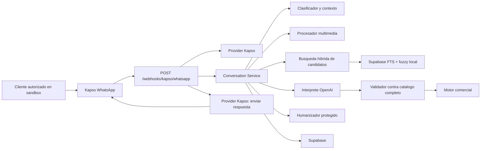

# AIVANCE WhatsApp IA

Backend conversacional multiempresa de AIVANCE para atender clientes por WhatsApp. Distrifinca es el primer cliente configurado de la plataforma. El agente entiende lenguaje informal, consulta un catalogo controlado por el backend, arma pedidos y conserva el contexto de cada cliente.

Kapso es el proveedor activo de WhatsApp. Twilio pertenece solamente al antecedente historico del proyecto. El sandbox sigue siendo el entorno recomendado para validar cambios antes de llevarlos al numero comercial.

## Estado actual

- Proveedor de WhatsApp activo: Kapso.
- Entorno recomendado para pruebas y regresiones: sandbox de Kapso.
- Persistencia: Supabase por REST API, con memoria local como respaldo para desarrollo de conversaciones.
- Cliente: se resuelve dinamicamente por el canal WhatsApp registrado en Supabase (`phone_number_id`, `workspace_id` o `integration_id`).
- Tipo de negocio: se lee desde `aivance_clients.business_type` o `vertical`.
- Vertical operativa: `petshop`. La vertical `guarderia` esta registrada como placeholder y se bloquea hasta implementar su flujo.
- Catalogo operativo: Supabase, separado por cliente AIVANCE y consolidado en tiempo de ejecucion.
- Importacion de catalogo: `productos.json` como formato de carga masiva. El archivo actual contiene 392 marcas, 1120 referencias y 1394 presentaciones antes de consolidar duplicados ortograficos.
- IA: OpenAI para interpretar mensajes, humanizar respuestas, analizar imagenes y transcribir voz.
- Pruebas automatizadas: `npm test`.

## Capacidades principales

- Comprende saludos, pedidos, consultas de precio, cotizaciones y recomendaciones.
- Distingue entre consultar un precio y agregar un producto al carrito.
- Procesa varios productos enviados en el mismo mensaje.
- Conserva contexto entre mensajes cortos como `de 4kl`, `asi esta bien` o `agrega los dos`.
- Interpreta abreviaturas, errores de escritura y razas de mascotas sin programar una lista raza por raza.
- Busca por nombre, descripcion, aliases, `metadata.original_names`, referencias equivalentes y contexto conversacional.
- Consolida dinamicamente marcas o referencias duplicadas por errores ortograficos y une sus presentaciones sin reglas por producto.
- Combina candidatos de Supabase FTS con candidatos fuzzy locales antes de interpretar que una referencia no existe.
- En imagenes pondera marca, linea o variante, especie, presentacion y sabor; si la primera lectura es ambigua puede ejecutar una segunda lectura enfocada.
- Valida marcas, referencias, presentaciones y precios contra el catalogo completo antes de responder.
- Rechaza presentaciones inexistentes y ofrece alternativas reales.
- Gestiona carrito, cantidades, eliminaciones, entrega, datos del cliente y metodo de pago.
- Recibe imagenes por URL de Kapso para analizarlas con vision.
- Transcribe audios reales con OpenAI cuando Kapso entrega URL descargable; usa modelo fallback y transcript de Kapso como respaldo.
- Guarda conversaciones, mensajes, pedidos confirmados y ejemplos curados en Supabase.

## Arquitectura



La mensajeria esta aislada en `src/providers/kapsoMessagingProvider.js`. La logica comercial y la persistencia no dependen del proveedor de WhatsApp. El cliente se resuelve con `src/services/clients.service.js`: el backend toma identificadores del canal Kapso (`phone_number_id`, `workspace_id` o `integration_id`), busca una fila activa en `client_channels` y carga el cliente desde `aivance_clients`. Luego `src/verticals/index.js` selecciona la logica por `business_type`/`vertical`. `CLIENT_SLUG` ya no es base multiempresa ni variable operativa.

`petshop` es la unica vertical conversacional implementada. `guarderia` existe en el registro para preparar clientes como `sanmarcospetsclub`, pero `implemented: false` hace que el backend rechace ese flujo hasta que tenga reglas conversacionales reales.

La resolucion de productos se reparte entre `catalogContextService`, `catalogConsolidationService`, `productMatchValidator` y `pendingProductMatchService`. OpenAI propone una interpretacion, pero estos servicios recuperan candidatos, toleran errores de catalogo/OCR, validan la identidad contra el catalogo completo y conservan selecciones pendientes. No existe una excepcion programada para referencias concretas.

Los mensajes consecutivos del mismo cliente se agrupan antes de llamar al agente. Cada mensaje reinicia la espera para recopilar el turno completo. La ventana local se configura con `INBOUND_MESSAGE_BUFFER_MS`; el valor recomendado para WhatsApp es `5000`.

## Inicio rapido

Requisitos:

- Node.js 20.19 o superior.
- Un proyecto de Supabase.
- Una API key de OpenAI.
- Un proyecto y sandbox de Kapso.

Instala dependencias:

```bash
npm install
```

Completa las variables en `.env`, ejecuta el esquema de Supabase y arranca el servidor:

```bash
npm start
```

Para un proyecto nuevo ejecuta primero `supabase/schema.sql`. Para una base existente ejecuta las migraciones indicadas en [docs/aivance-multiempresa.md](docs/aivance-multiempresa.md). El catalogo se importa siempre indicando explicitamente a que cliente pertenece; no hay cliente por defecto para evitar mezclar productos entre empresas.

El archivo `productos.json` actual corresponde al catalogo de importacion de Distrifinca:

```bash
npm run catalog:import -- --file productos.json --client distrifinca --client-name Distrifinca --vertical petshop
```

Para otra empresa petshop se usa la misma logica vertical, pero otro cliente y otro archivo de productos:

```bash
npm run catalog:import -- --file productos-mi-petshop.json --client mi_petshop --client-name "Mi Petshop" --vertical petshop
```

Para reemplazar el catalogo activo de un cliente antes de importar, agrega `--replace`.

Despues registra el canal de Kapso para el cliente en Supabase. Ese registro es el que permite resolver el cliente sin tocar `.env`:

```sql
insert into public.client_channels (client_id, provider, channel, phone_number_id, display_name)
select id, 'kapso', 'whatsapp', 'KAPSO_PHONE_NUMBER_ID', 'WhatsApp Distrifinca'
from public.aivance_clients
where slug = 'distrifinca'
on conflict do nothing;
```

Mientras uses el sandbox antes de registrar el canal en Supabase, configura:

```env
KAPSO_SANDBOX_PHONE_NUMBER_ID=...
KAPSO_SANDBOX_CLIENT_SLUG=distrifinca
```

Esa resolucion solo aplica fuera de `NODE_ENV=production` y solo cuando el `phone_number_id` del evento coincide con `KAPSO_SANDBOX_PHONE_NUMBER_ID` o `KAPSO_PHONE_NUMBER_ID`. En produccion el canal debe existir en `client_channels`.

El backend expone:

```text
GET  /health
POST /webhooks/kapso/whatsapp
```

Para configurar o verificar Kapso paso a paso consulta [docs/kapso-migration.md](docs/kapso-migration.md).

## Verificacion

Ejecuta la suite:

```bash
npm test
```

Comprueba el servidor:

```bash
curl http://localhost:3000/health
```

Respuesta esperada:

```json
{ "ok": true, "provider": "kapso" }
```

## Documentacion

- [Contexto tecnico vigente](docs/project-context.md)
- [Arquitectura multiempresa AIVANCE](docs/aivance-multiempresa.md)
- [Kapso: sandbox y paso a produccion](docs/kapso-migration.md)
- [Riesgos y hoja de ruta](docs/known-issues-and-roadmap.md)
- [Ejemplos de entrenamiento](docs/training-examples.md)
- [Auditoria de contexto y costos](docs/context-audit.md)

## Principio central

La IA interpreta el lenguaje humano y mantiene una conversacion agradable. El backend sigue siendo la fuente de verdad para marcas, referencias, presentaciones, precios y cambios reales del carrito.
