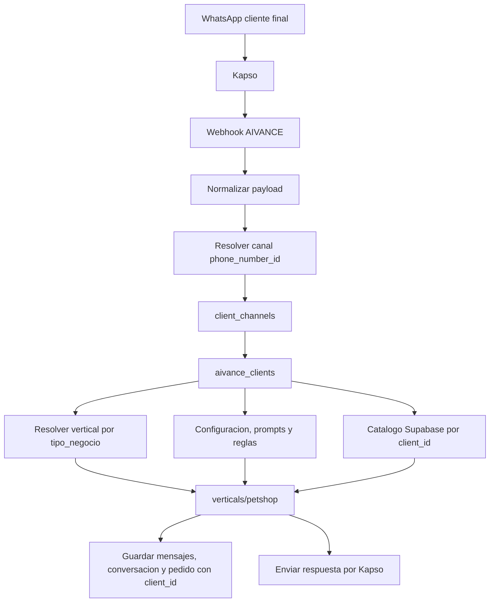

# AIVANCE Multiempresa

## Resumen

AIVANCE es la plataforma propietaria del software. Distrifinca queda configurado como el primer cliente de la plataforma, no como dueño del sistema.

El agente conserva el mismo comportamiento funcional: Kapso recibe WhatsApp, OpenAI interpreta/humaniza, el motor valida catalogo, Supabase guarda memoria y Kapso envia la respuesta. El cambio arquitectonico es que el cliente ya no se define por `.env`; se resuelve por el canal de WhatsApp registrado en Supabase.

## Cambios Realizados

- Se creo `src/services/clients.service.js` para resolver clientes por canal Kapso.
- `src/services/conversationService.js` carga cliente, catalogo, prompts y reglas antes de procesar el mensaje.
- `src/providers/kapsoMessagingProvider.js` extrae `phoneNumberId` desde varios campos posibles del payload Kapso.
- `src/repositories/productRepository.js` consulta productos desde Supabase por `client_id`.
- `productos.json` dejo de ser fuente del agente y queda como formato de importacion masiva.
- `scripts/import-products.js` importa catalogos JSON hacia Supabase por cliente y vertical.
- `src/conversation/conversationStore.js` separa memoria local por cliente y usuario.
- `src/repositories/supabaseConversationRepository.js` guarda conversaciones, mensajes y pedidos con `client_id`.
- `src/repositories/trainingExampleRepository.js` soporta ejemplos globales o por cliente.
- `src/services/aiInterpreter.js` y `src/services/humanizer.js` pueden recibir prompts adicionales por cliente sin cambiar el flujo base.
- Se movio la logica conversacional actual a `src/verticals/petshop`, para que Distrifinca y futuras tiendas de mascotas compartan la misma vertical.
- Se agrego `src/verticals/index.js` para seleccionar la logica por `cliente.vertical`, tratado como `tipo_negocio`.
- Se agregaron `supabase/schema.sql` y `supabase/004_multiempresa_catalog.sql` como scripts completos para proyectos nuevos y bases existentes.

## Carpetas y Archivos

Archivos nuevos:

- `src/services/clients.service.js`
- `src/verticals/index.js`
- `src/verticals/petshop/orderLogic.js`
- `src/verticals/petshop/productLogic.js`
- `src/verticals/petshop/prompt.js`
- `src/verticals/petshop/tools.js`
- `src/repositories/supabaseClient.js`
- `scripts/import-products.js`
- `supabase/004_multiempresa_catalog.sql`
- `docs/aivance-multiempresa.md`
- `test/clientsService.test.js`
- `test/productRepository.test.js`

Archivos modificados:

- `README.md`
- `.env`
- `package.json`
- `docs/project-context.md`
- `docs/kapso-migration.md`
- `docs/known-issues-and-roadmap.md`
- `src/services/conversationService.js`
- `src/services/aiInterpreter.js`
- `src/services/humanizer.js`
- `src/providers/kapsoMessagingProvider.js`
- `src/conversation/conversationStore.js`
- `src/repositories/productRepository.js`
- `src/repositories/supabaseConversationRepository.js`
- `src/repositories/trainingExampleRepository.js`
- `supabase/schema.sql`

No se crearon carpetas por cliente. Distrifinca vive como dato en Supabase. Si aparece un nuevo tipo de negocio con logica distinta, la extension futura debe vivir por vertical, no por cliente.

## Arquitectura



## Separacion Por Verticales

La columna `aivance_clients.vertical` representa el `tipo_negocio` operativo del cliente. El objeto de cliente tambien expone `businessType` y `tipo_negocio` como alias internos para que el codigo lea el concepto de negocio sin agregar otra columna.

La logica actual quedo clasificada como petshop:

- `src/verticals/petshop/orderLogic.js`: motor conversacional y de pedido actual.
- `src/verticals/petshop/productLogic.js`: barrera de catalogo para no afirmar presentaciones inexistentes.
- `src/verticals/petshop/tools.js`: utilidades de deteccion usadas por el flujo conversacional.
- `src/verticals/petshop/prompt.js`: contexto adicional de la vertical para OpenAI.

Para un futuro restaurante se debe crear una vertical nueva en `src/verticals/restaurant` con su propio motor, prompts y reglas. No se debe crear `clients/distrifinca` ni carpetas por empresa.

## Identificacion Del Cliente

Cuando llega un mensaje, el backend toma `evento.phoneNumberId` normalizado desde el payload de Kapso. Luego:

1. Busca una fila activa en `client_channels` con `provider='kapso'`, `channel='whatsapp'` y ese `phone_number_id`.
2. Usa `client_channels.client_id` para cargar el cliente activo en `aivance_clients`.
3. Lee `aivance_clients.vertical` como tipo de negocio.
4. Selecciona la vertical con `src/verticals/index.js`.
5. Carga prompts activos desde `client_prompts`.
6. Carga reglas/fletes activos desde `client_delivery_rules`.
7. Carga productos desde `catalog_brands`, `catalog_references` y `catalog_presentations` filtrados por `client_id`.
8. Guarda conversaciones, mensajes, pedidos y ejemplos usando ese `client_id`.

Si Supabase no esta configurado, el sistema falla con un error explicito. Si el canal no existe, tambien falla salvo en pruebas de sandbox fuera de produccion, donde se puede usar `KAPSO_SANDBOX_CLIENT_SLUG` para asociar temporalmente el numero sandbox a un cliente existente de Supabase.

## Tablas Creadas

Ejecuta `supabase/schema.sql` en proyectos nuevos o `supabase/004_multiempresa_catalog.sql` en una base existente.

Tablas nuevas:

- `aivance_clients`: clientes de la plataforma AIVANCE.
- `client_channels`: canales por cliente, por ejemplo Kapso WhatsApp.
- `client_prompts`: prompts/reglas de lenguaje por cliente.
- `client_delivery_rules`: fletes y reglas de entrega por cliente.
- `catalog_brands`: marcas del catalogo por cliente.
- `catalog_references`: referencias por marca.
- `catalog_presentations`: presentaciones, precios y moneda por referencia.

Tablas existentes extendidas:

- `whatsapp_conversations.client_id`
- `whatsapp_messages.client_id`
- `whatsapp_orders.client_id`
- `training_examples.client_id`

## Relaciones

- `aivance_clients.id` -> `client_channels.client_id`
- `aivance_clients.id` -> `client_prompts.client_id`
- `aivance_clients.id` -> `client_delivery_rules.client_id`
- `aivance_clients.id` -> `catalog_brands.client_id`
- `catalog_brands.id` -> `catalog_references.brand_id`
- `catalog_references.id` -> `catalog_presentations.reference_id`
- `aivance_clients.id` -> `whatsapp_conversations.client_id`
- `aivance_clients.id` -> `whatsapp_messages.client_id`
- `aivance_clients.id` -> `whatsapp_orders.client_id`
- `aivance_clients.id` -> `training_examples.client_id`

Los registros historicos se asignan a Distrifinca durante la migracion.

## SQL Manual

Los scripts completos estan en:

- `supabase/schema.sql`: esquema completo para un proyecto Supabase nuevo.
- `supabase/004_multiempresa_catalog.sql`: migracion completa para una base existente.

Despues de ejecutar el SQL, asocia el canal de Kapso de Distrifinca:

```sql
insert into public.client_channels (client_id, provider, channel, phone_number_id, display_name)
select id, 'kapso', 'whatsapp', 'TU_KAPSO_PHONE_NUMBER_ID', 'WhatsApp Distrifinca'
from public.aivance_clients
where slug = 'distrifinca'
on conflict do nothing;
```

## Registrar Un Cliente

```sql
insert into public.aivance_clients (slug, name, vertical, owner_platform, status)
values ('nuevo_cliente', 'Nuevo Cliente', 'petshop', 'AIVANCE', 'active')
on conflict (slug) do update
set
  name = excluded.name,
  vertical = excluded.vertical,
  status = excluded.status,
  updated_at = now();
```

## Asociar WhatsApp A Un Cliente

```sql
insert into public.client_channels (client_id, provider, channel, phone_number_id, display_name)
select id, 'kapso', 'whatsapp', 'PHONE_NUMBER_ID_DE_KAPSO', 'WhatsApp Nuevo Cliente'
from public.aivance_clients
where slug = 'nuevo_cliente'
on conflict do nothing;
```

Con eso el cliente nuevo queda resoluble sin tocar codigo ni `.env`.

## Configurar Prompts Por Cliente

```sql
insert into public.client_prompts (client_id, prompt_key, content, active, priority)
select id, 'humanizer', 'Instrucciones de tono especificas del cliente.', true, 100
from public.aivance_clients
where slug = 'nuevo_cliente'
on conflict (client_id, prompt_key) do update
set content = excluded.content, active = excluded.active, priority = excluded.priority, updated_at = now();
```

Claves soportadas por el codigo actual:

- `interpreter` o `interprete`: instrucciones adicionales para interpretar intencion.
- `humanizer` o `humanizador`: instrucciones adicionales para redactar la respuesta final.

## Configurar Fletes O Reglas

```sql
insert into public.client_delivery_rules (client_id, rule_type, name, value, active, priority)
select id, 'flat_delivery_fee', 'domicilio_base', '{"amount": 5000, "currency": "COP"}'::jsonb, true, 100
from public.aivance_clients
where slug = 'nuevo_cliente'
on conflict (client_id, rule_type, name) do update
set value = excluded.value, active = excluded.active, priority = excluded.priority, updated_at = now();
```

Estas reglas ya se cargan como contexto de cliente. No agregan una regla comercial nueva por si solas; quedan listas para que el motor las use cuando se decida ampliar esa parte.

## Importar Productos Desde JSON

El JSON debe conservar este formato:

```json
[
  {
    "marca": "Chunky",
    "referencias": [
      {
        "nombre": "Adulto Todas las Razas",
        "especie": "perro",
        "descripcion": "Alimento completo para perros adultos",
        "imagen": "https://...",
        "presentaciones": [
          { "peso": "2kg", "precio": 32000 }
        ]
      }
    ]
  }
]
```

Importar Distrifinca:

```bash
npm run catalog:import -- --file productos.json --client distrifinca --client-name Distrifinca --vertical petshop
```

Importar otro cliente:

```bash
npm run catalog:import -- --file productos-nuevo-cliente.json --client nuevo_cliente --client-name "Nuevo Cliente" --vertical petshop
```

El importador no tiene cliente por defecto. Siempre se deben pasar `--client` y `--client-name`; asi dos empresas pueden compartir la vertical `petshop` sin compartir productos.

## Importar Desde Excel

1. Organiza Excel con columnas minimas:

```text
marca, referencia, especie, descripcion, imagen, peso, precio
```

2. Convierte el Excel a JSON compatible con `productos.json`.
3. Agrupa cada referencia con sus presentaciones.
4. Ejecuta `npm run catalog:import` apuntando al JSON convertido.

Flujo recomendado:

```text
Excel -> JSON compatible -> scripts/import-products.js -> Supabase
```

## Agregar Futuros Clientes

1. Crear fila en `aivance_clients`.
2. Registrar su numero/canal en `client_channels`.
3. Cargar prompts o reglas si ese cliente necesita instrucciones propias.
4. Convertir su catalogo a JSON.
5. Ejecutar `npm run catalog:import`.
6. Probar texto, imagen, audio, cotizacion, carrito y confirmacion.

No se modifica `.env`, no se crean carpetas por cliente y no se duplica repositorio.

## Agregar Una Nueva Vertical

1. Crear carpeta `src/verticals/nueva_vertical`.
2. Implementar su `orderLogic.js`, `productLogic.js`, `prompt.js` y `tools.js` segun aplique.
3. Registrar la vertical en `src/verticals/index.js`.
4. Crear clientes en Supabase con `vertical='nueva_vertical'`.
5. Cargar catalogo, prompts, fletes y configuracion desde Supabase.

Solo se crea codigo por tipo de negocio. Un cliente nuevo sigue siendo un registro en Supabase.

## Confirmaciones

- El agente conserva el mismo flujo conversacional.
- OpenAI, Kapso y Supabase siguen el flujo actual.
- Los productos operativos salen de Supabase mediante `cargarCatalogoCliente`.
- `productos.json` ya no es fuente operativa del agente; es formato de importacion.
- Distrifinca queda configurado como cliente de AIVANCE con `slug='distrifinca'` y `vertical='petshop'`.
- `CLIENT_SLUG` y `CLIENT_NAME` no son base multiempresa y no forman parte del `.env` operativo.
- El sistema queda preparado para multiples clientes sin duplicar repositorios ni logica conversacional.
- No hay logica quemada tipo `if clientSlug === "distrifinca"`.
