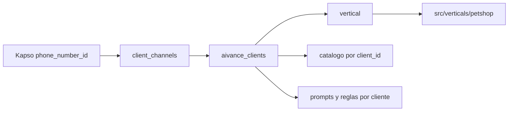

# AIVANCE Multiempresa

Este documento describe como AIVANCE soporta varias empresas cliente sin duplicar repositorios ni crear carpetas por cliente. Para el flujo tecnico completo consulta `docs/project-context.md`.

## Modelo

- AIVANCE es la plataforma propietaria.
- Cada empresa cliente vive en `aivance_clients`.
- Cada numero/canal vive en `client_channels`.
- La logica se organiza por vertical de negocio, no por cliente.
- Distrifinca es un cliente con `slug='distrifinca'` y `vertical='petshop'`.

El mensaje entrante se resuelve asi:



## Tablas

| Tabla | Responsabilidad |
| --- | --- |
| `aivance_clients` | Empresas cliente de la plataforma. |
| `client_channels` | Numeros o canales conectados a cada cliente. |
| `client_prompts` | Instrucciones adicionales para interprete o humanizador. |
| `client_delivery_rules` | Reglas/fletes por cliente. |
| `catalog_brands` | Marcas por cliente. |
| `catalog_references` | Referencias por marca. |
| `catalog_presentations` | Presentaciones y precios por referencia. |
| `whatsapp_conversations` | Estado por usuario final y empresa. |
| `whatsapp_messages` | Historial por empresa. |
| `whatsapp_orders` | Pedidos confirmados por empresa. |
| `training_examples` | Ejemplos globales o por empresa. |

Scripts:

- `supabase/schema.sql`: esquema completo para proyectos nuevos.
- `supabase/004_multiempresa_catalog.sql`: migracion para bases existentes.
- `supabase/005_catalog_search_rpc.sql`: busqueda FTS/trigram por cliente.
- `supabase/005_petshop_product_classification.sql`: clasificacion comercial petshop.

## Alta De Cliente

Crear o actualizar cliente:

```sql
insert into public.aivance_clients (slug, name, vertical, owner_platform, status)
values ('nuevo_cliente', 'Nuevo Cliente', 'petshop', 'AIVANCE', 'active')
on conflict (slug) do update
set
  name = excluded.name,
  vertical = excluded.vertical,
  status = excluded.status,
  updated_at = now();
```

Asociar WhatsApp:

```sql
insert into public.client_channels
  (client_id, provider, channel, phone_number_id, display_name, active)
select
  id,
  'kapso',
  'whatsapp',
  'PHONE_NUMBER_ID_DE_KAPSO',
  'WhatsApp Nuevo Cliente',
  true
from public.aivance_clients
where slug = 'nuevo_cliente'
on conflict (client_id, provider, channel, phone_number_id)
do update set
  display_name = excluded.display_name,
  active = true,
  updated_at = now();
```

Verificar:

```sql
select
  ac.slug,
  ac.vertical,
  cc.phone_number_id,
  cc.active
from public.client_channels cc
join public.aivance_clients ac on ac.id = cc.client_id
where cc.provider = 'kapso'
  and cc.channel = 'whatsapp';
```

## Prompts Por Cliente

Claves soportadas:

- `interpreter` o `interprete`: instrucciones adicionales para interpretar.
- `humanizer` o `humanizador`: instrucciones de tono.

Ejemplo:

```sql
insert into public.client_prompts
  (client_id, prompt_key, content, active, priority)
select
  id,
  'humanizer',
  'Instrucciones de tono especificas del cliente.',
  true,
  100
from public.aivance_clients
where slug = 'nuevo_cliente'
on conflict (client_id, prompt_key) do update
set
  content = excluded.content,
  active = excluded.active,
  priority = excluded.priority,
  updated_at = now();
```

## Reglas De Entrega

Las reglas se cargan como contexto del cliente. El motor solo las aplica cuando la vertical tenga soporte para esa regla.

```sql
insert into public.client_delivery_rules
  (client_id, rule_type, name, value, active, priority)
select
  id,
  'flat_delivery_fee',
  'domicilio_base',
  '{"amount": 5000, "currency": "COP"}'::jsonb,
  true,
  100
from public.aivance_clients
where slug = 'nuevo_cliente'
on conflict (client_id, rule_type, name) do update
set
  value = excluded.value,
  active = excluded.active,
  priority = excluded.priority,
  updated_at = now();
```

## Catalogo Por Cliente

El JSON de importacion debe conservar esta forma:

```json
[
  {
    "marca": "Chunky",
    "referencias": [
      {
        "nombre": "Adulto Todas las Razas",
        "especie": "perro",
        "descripcion": "Alimento completo para perros adultos",
        "imagen": "https://...",
        "presentaciones": [
          { "peso": "2kg", "precio": 32000 }
        ]
      }
    ]
  }
]
```

Importar Distrifinca:

```bash
npm run catalog:import -- --file productos.json --client distrifinca --client-name Distrifinca --vertical petshop
```

Importar otro cliente:

```bash
npm run catalog:import -- --file productos-nuevo-cliente.json --client nuevo_cliente --client-name "Nuevo Cliente" --vertical petshop
```

El importador no tiene cliente por defecto. Siempre pasa `--client` y `--client-name`.

El catalogo puede incluir aliases, `metadata.original_names` y nombres heredados con errores. El backend consolida typos compatibles en tiempo de ejecucion y fusiona presentaciones equivalentes sin crear reglas por producto.

## Desde Excel

Columnas minimas recomendadas:

```text
marca, referencia, especie, descripcion, imagen, peso, precio
```

Flujo:

```text
Excel -> JSON compatible -> npm run catalog:import -> Supabase
```

## Nueva Vertical

Crea codigo solo cuando cambia el tipo de negocio:

1. Crear `src/verticals/nueva_vertical`.
2. Implementar `orderLogic.js`, `productLogic.js`, `prompt.js` y `tools.js` segun aplique.
3. Registrar la vertical en `src/verticals/index.js`.
4. Crear clientes en Supabase con `vertical='nueva_vertical'`.
5. Importar catalogo y configurar prompts/reglas desde Supabase.

## Reglas De Diseno

- Un cliente nuevo es un registro en Supabase.
- Una vertical nueva es codigo.
- No usar condiciones tipo `if clientSlug === "distrifinca"`.
- No usar `.env` para elegir cliente.
- No compartir catalogo entre empresas salvo que se importe explicitamente para cada `client_id`.
- No guardar secretos ni datos personales innecesarios en prompts, ejemplos o catalogos.
