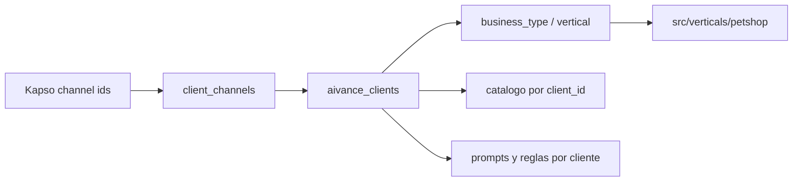

# AIVANCE Multiempresa

Este documento describe como AIVANCE soporta varias empresas cliente sin duplicar repositorios ni crear carpetas por cliente. Para el flujo tecnico completo consulta `docs/project-context.md`.

## Modelo

- AIVANCE es la plataforma propietaria.
- Cada empresa cliente vive en `aivance_clients`.
- Cada numero/canal vive en `client_channels`.
- La logica se organiza por vertical de negocio, no por cliente.
- Distrifinca es un cliente con `slug='distrifinca'` y `vertical='petshop'`.
- `business_type` es el campo preferido para elegir vertical; `vertical` queda como compatibilidad.
- `guarderia` esta registrada como vertical futura, pero no tiene flujo conversacional activo.

El mensaje entrante se resuelve asi:



## Tablas

| Tabla | Responsabilidad |
| --- | --- |
| `aivance_clients` | Empresas cliente de la plataforma. |
| `client_channels` | Numeros o canales conectados a cada cliente; puede resolver por `phone_number_id`, `workspace_id` o `integration_id`. |
| `client_prompts` | Instrucciones adicionales para interprete o humanizador. |
| `client_delivery_rules` | Reglas/fletes por cliente. |
| `catalog_brands` | Marcas por cliente. |
| `catalog_references` | Referencias por marca. |
| `catalog_presentations` | Presentaciones y precios por referencia. |
| `whatsapp_conversations` | Estado por usuario final y empresa. |
| `whatsapp_messages` | Historial por empresa. |
| `whatsapp_orders` | Pedidos confirmados por empresa. |
| `training_examples` | Ejemplos globales o por empresa. |

Scripts:

- `supabase/schema.sql`: esquema completo para proyectos nuevos.
- `supabase/004_multiempresa_catalog.sql`: migracion para bases existentes.
- `supabase/005_catalog_search_rpc.sql`: busqueda FTS/trigram por cliente.
- `supabase/005_petshop_product_classification.sql`: clasificacion comercial petshop.
- `supabase/006_multi_vertical_clients.sql`: alias `business_type`, identificadores alternos de canal y registro inicial de `sanmarcospetsclub`.

## Que Pasa Al Agregar Mas Clientes

Agregar otro cliente de una vertical implementada no deberia crear otro backend, otra carpeta ni reglas especiales en codigo. El cambio normal es de datos y configuracion:

1. Crear una fila en `aivance_clients`.
2. Registrar uno o mas canales en `client_channels`.
3. Importar catalogo con `--client`.
4. Configurar prompts, tono y reglas operativas del cliente.
5. Probar el numero Kapso real o sandbox asociado a ese cliente.

Cuando llega un mensaje, el backend no pregunta "de que cliente es" al usuario final. Lo deduce por los identificadores recibidos desde Kapso. La busqueda intenta `phone_number_id`, luego `workspace_id` y luego `integration_id`; uno de esos valores debe apuntar a un solo cliente activo en `client_channels`. Desde ahi se cargan su vertical, catalogo, reglas, prompts, conversaciones y pedidos.

Separacion esperada por cliente:

| Area | Como se separa |
| --- | --- |
| Canal WhatsApp | Fila unica activa en `client_channels` por `phone_number_id` cuando exista; `workspace_id` o `integration_id` pueden respaldar la resolucion. |
| Catalogo y precios | Registros ligados al `client_id`. |
| Conversaciones | `whatsapp_conversations` por `client_id + channel_user_id`. |
| Historial | `whatsapp_messages` filtrado por `client_id`. |
| Pedidos | `whatsapp_orders` ligados al cliente. |
| Tono y reglas | `client_prompts` y `client_delivery_rules`. |
| Logica comercial | Compartida por vertical, no por empresa. |

Ejemplo: si Distrifinca y otra tienda petshop venden "Chunky Adulto", cada una debe tener su propia referencia/precio en su catalogo. El usuario final puede tener el mismo celular en ambas tiendas; el estado conversacional no debe mezclarse porque el `client_id` cambia.

`sanmarcospetsclub` queda registrado como cliente de vertical `guarderia` en estado `setup_pending`. Aunque el registro de la vertical existe en codigo, `implemented: false` hace que el servicio rechace conversaciones de guarderia. No debe activarse hasta implementar el flujo y registrar su canal Kapso.

## Organizacion Recomendada

Para operar varios clientes sin desorden, mantener un inventario por cliente con:

- `slug`, nombre comercial, `business_type`/vertical y estado.
- `phone_number_id`, `workspace_id`, `integration_id`, numero visible y ambiente: sandbox o produccion.
- archivo/fuente de catalogo, fecha de ultima importacion y responsable de aprobar precios.
- reglas de domicilio, sedes, cobertura, pagos y horarios.
- prompts activos de interprete/humanizador y criterio de tono.
- checklist de pruebas antes de activar el numero.
- contactos internos para soporte comercial y tecnico.

Convenciones recomendadas:

- Usar slugs estables, por ejemplo `distrifinca`, `mi_petshop`, `cliente_bogota`.
- Nombrar catalogos por cliente y fecha, por ejemplo `catalogos/mi_petshop-2026-06.json`.
- No reutilizar `productos.json` para varios clientes salvo que sea una copia revisada.
- Registrar cada numero Kapso antes de probar flujos reales.
- Mantener ejemplos de entrenamiento globales solo para criterios generales; los casos muy propios de una tienda deben guardarse por cliente cuando aplique.

## Problemas A Vigilar Con Varios Clientes

- Un identificador de canal mal registrado enviaria la conversacion al cliente equivocado.
- Si se importa catalogo sin `--client`, o con slug incorrecto, se mezclan precios/productos.
- Prompts demasiado especificos de Distrifinca podrian contaminar otra empresa petshop.
- Reglas de domicilio y pago pueden variar por cliente aunque compartan vertical.
- El fallback `KAPSO_SANDBOX_CLIENT_SLUG` solo sirve en desarrollo; usarlo como operacion normal oculta errores de canal.
- Cache, idempotencia y locks en memoria son suficientes para una instancia, pero no para escalar horizontalmente con varios clientes activos.
- Observabilidad sin `client_id`, identificador de canal y `messageId` dificulta saber que cliente fallo.

## Checklist De Alta

Antes de activar un cliente:

- Cliente creado en `aivance_clients` con `status='active'`.
- Canal Kapso creado en `client_channels`, activo y con identificador correcto.
- Webhook de Kapso apuntando a `/webhooks/kapso/whatsapp`.
- Catalogo importado y validado con conteos esperados.
- Prompts y reglas revisados para que no mencionen otra empresa.
- Pruebas de texto, imagen, audio, consulta de precio, carrito y confirmacion.
- Logs revisados con `client_id`/slug esperado.
- Plan de soporte definido para errores de catalogo, pagos, domicilio y despacho.

## Alta De Cliente

Crear o actualizar cliente:

```sql
insert into public.aivance_clients (slug, name, vertical, business_type, owner_platform, status)
values ('nuevo_cliente', 'Nuevo Cliente', 'petshop', 'petshop', 'AIVANCE', 'active')
on conflict (slug) do update
set
  name = excluded.name,
  vertical = excluded.vertical,
  business_type = excluded.business_type,
  status = excluded.status,
  updated_at = now();
```

Asociar WhatsApp:

```sql
insert into public.client_channels
  (client_id, provider, channel, phone_number_id, display_name, active)
select
  id,
  'kapso',
  'whatsapp',
  'PHONE_NUMBER_ID_DE_KAPSO',
  'WhatsApp Nuevo Cliente',
  true
from public.aivance_clients
where slug = 'nuevo_cliente'
on conflict (client_id, provider, channel, phone_number_id)
do update set
  display_name = excluded.display_name,
  active = true,
  updated_at = now();
```

Si Kapso no entrega `phone_number_id` de forma confiable para un caso puntual, tambien puedes registrar `workspace_id` o `integration_id` en la misma tabla. Mantener `phone_number_id` como identificador principal sigue siendo lo recomendado para numeros WhatsApp.

Verificar:

```sql
select
  ac.slug,
  ac.business_type,
  cc.phone_number_id,
  cc.workspace_id,
  cc.integration_id,
  cc.active
from public.client_channels cc
join public.aivance_clients ac on ac.id = cc.client_id
where cc.provider = 'kapso'
  and cc.channel = 'whatsapp';
```

## Prompts Por Cliente

Claves soportadas:

- `interpreter` o `interprete`: instrucciones adicionales para interpretar.
- `humanizer` o `humanizador`: instrucciones de tono.

Ejemplo:

```sql
insert into public.client_prompts
  (client_id, prompt_key, content, active, priority)
select
  id,
  'humanizer',
  'Instrucciones de tono especificas del cliente.',
  true,
  100
from public.aivance_clients
where slug = 'nuevo_cliente'
on conflict (client_id, prompt_key) do update
set
  content = excluded.content,
  active = excluded.active,
  priority = excluded.priority,
  updated_at = now();
```

## Reglas De Entrega

Las reglas se cargan como contexto del cliente. El motor solo las aplica cuando la vertical tenga soporte para esa regla.

```sql
insert into public.client_delivery_rules
  (client_id, rule_type, name, value, active, priority)
select
  id,
  'flat_delivery_fee',
  'domicilio_base',
  '{"amount": 5000, "currency": "COP"}'::jsonb,
  true,
  100
from public.aivance_clients
where slug = 'nuevo_cliente'
on conflict (client_id, rule_type, name) do update
set
  value = excluded.value,
  active = excluded.active,
  priority = excluded.priority,
  updated_at = now();
```

## Catalogo Por Cliente

El JSON de importacion debe conservar esta forma:

```json
[
  {
    "marca": "Chunky",
    "referencias": [
      {
        "nombre": "Adulto Todas las Razas",
        "especie": "perro",
        "categoria": "comida",
        "subcategoria": "concentrado",
        "etapa": "adulto",
        "requiere_confirmacion": false,
        "descripcion": "Alimento completo para perros adultos",
        "imagen": "https://...",
        "presentaciones": [
          { "peso": "2kg", "precio": 32000, "stock": true }
        ]
      }
    ]
  }
]
```

Campos como `categoria`, `subcategoria`, `etapa`, `requiere_confirmacion` y `stock` son opcionales, pero recomendados. Si faltan, el importador intenta inferir parte de la clasificacion desde nombre y descripcion; aun asi, para medicamentos, antipulgas, desparasitantes, snacks, accesorios, juguetes, arena/sustratos y suplementos conviene cargarlos explicitamente.

`stock` es disponibilidad basica por presentacion. No reemplaza un inventario real por cantidad, sede o reserva.

Importar Distrifinca:

```bash
npm run catalog:import -- --file productos.json --client distrifinca --client-name Distrifinca --vertical petshop
```

Importar otro cliente:

```bash
npm run catalog:import -- --file productos-nuevo-cliente.json --client nuevo_cliente --client-name "Nuevo Cliente" --vertical petshop
```

El importador no tiene cliente por defecto. Siempre pasa `--client` y `--client-name`. Usa `--replace` cuando quieras desactivar primero el catalogo activo del cliente y cargar una version nueva completa.

El catalogo puede incluir aliases, `metadata.original_names` y nombres heredados con errores. El backend consolida typos compatibles en tiempo de ejecucion y fusiona presentaciones equivalentes sin crear reglas por producto.

## Desde Excel

Columnas minimas recomendadas:

```text
marca, referencia, especie, descripcion, imagen, peso, precio
```

Flujo:

```text
Excel -> JSON compatible -> npm run catalog:import -> Supabase
```

## Nueva Vertical

Crea codigo solo cuando cambia el tipo de negocio:

1. Crear `src/verticals/nueva_vertical`.
2. Implementar `orderLogic.js`, `productLogic.js`, `prompt.js` y `tools.js` segun aplique.
3. Registrar la vertical en `src/verticals/index.js`.
4. Marcar la vertical como implementada solo cuando pueda atender conversaciones reales.
5. Crear clientes en Supabase con `business_type='nueva_vertical'` y `vertical='nueva_vertical'`.
6. Importar catalogo y configurar prompts/reglas desde Supabase.

## Reglas De Diseno

- Un cliente nuevo es un registro en Supabase.
- Una vertical nueva es codigo.
- No usar condiciones tipo `if clientSlug === "distrifinca"`.
- No usar `.env` para elegir cliente.
- No compartir catalogo entre empresas salvo que se importe explicitamente para cada `client_id`.
- No guardar secretos ni datos personales innecesarios en prompts, ejemplos o catalogos.
