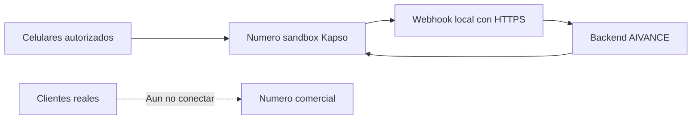

# Sandbox y migracion de Twilio a Kapso

El objetivo inicial no es responder mensajes del numero comercial. Primero se debe validar el agente dentro del sandbox de Kapso con celulares de prueba autorizados.

El backend recibe:

```text
POST /webhooks/kapso/whatsapp
```

Y expone:

```text
GET /health
```

## Estrategia recomendada



Mientras se construye el banco de pruebas:

- Usa el numero sandbox de Kapso.
- Autoriza solamente tus celulares de prueba.
- Registra el webhook solamente para el sandbox.
- Selecciona unicamente el evento `Message received`.
- No conectes todavia el numero comercial.

## 1. Crear el archivo de configuracion

Desde la raiz del proyecto:

```bash
revisa y completa .env
```

Completa progresivamente las variables descritas abajo.

## 2. Crear el sandbox

1. Entra al proyecto en Kapso.
2. Abre la seccion de WhatsApp y busca `Sandbox`.
3. Agrega tu numero personal como numero autorizado de prueba.
4. Usa formato internacional, por ejemplo `+573001112233`.
5. Kapso mostrara su numero sandbox y un codigo de activacion.
6. Abre WhatsApp y envia ese codigo al numero sandbox.
7. Espera el mensaje de confirmacion.
8. Repite el proceso para cada celular adicional del equipo de pruebas.

Solo los celulares autorizados deben escribir al sandbox.

## 3. Generar `KAPSO_API_KEY`

1. En Kapso entra a `Project Settings`.
2. Abre `API Keys`.
3. Crea una nueva llave con un nombre descriptivo, por ejemplo `distrifinca-sandbox-local`.
4. Copia el valor y guardalo solamente en `.env`.

```env
KAPSO_API_KEY=tu_api_key
```

No subas esta llave a Git ni la compartas en capturas.

## 4. Obtener `KAPSO_PHONE_NUMBER_ID`

1. En Kapso abre la configuracion de WhatsApp creada para el sandbox.
2. Copia el `Phone Number ID`.
3. Confirma visualmente que corresponde al sandbox y no al numero comercial.

```env
KAPSO_PHONE_NUMBER_ID=id_del_numero_sandbox
KAPSO_SANDBOX_CLIENT_SLUG=distrifinca
```

`KAPSO_SANDBOX_CLIENT_SLUG` permite probar el sandbox aunque el `phone_number_id` aun no exista en `client_channels`. Solo se usa fuera de `NODE_ENV=production`.

Tambien puedes consultar los numeros del proyecto con la API de Kapso:

```bash
curl --request GET \
  --url "https://api.kapso.ai/platform/v1/whatsapp/phone_numbers" \
  --header "X-API-Key: TU_KAPSO_API_KEY"
```

## 5. Generar `KAPSO_WEBHOOK_SECRET`

Este secreto lo defines tu. Permite comprobar que los eventos recibidos fueron enviados por Kapso.

Genera uno:

```bash
openssl rand -hex 32
```

Guarda el resultado:

```env
KAPSO_WEBHOOK_SECRET=secreto_generado
```

Usa exactamente el mismo valor al crear el webhook en Kapso.

## 6. Completar OpenAI y Supabase

El sandbox sigue usando el flujo completo del agente. Conserva:

```env
OPENAI_API_KEY=
OPENAI_MODEL=gpt-5.2-chat-latest
OPENAI_INTERPRETER_MODEL=gpt-5.2
OPENAI_VISION_MODEL=gpt-4.1
OPENAI_TRANSCRIPTION_MODEL=gpt-4o-mini-transcribe
OPENAI_TRANSCRIPTION_FALLBACK_MODEL=whisper-1
INBOUND_MESSAGE_BUFFER_MS=5000

SUPABASE_URL=
SUPABASE_SECRET_KEY=
```

En un proyecto Supabase nuevo, ejecuta `supabase/schema.sql` desde el SQL Editor. En una base existente ejecuta `supabase/004_multiempresa_catalog.sql`.

Luego registra el numero/canal de Kapso para Distrifinca. Este paso es obligatorio para que AIVANCE resuelva el cliente automaticamente sin cambiar `.env`:

```sql
insert into public.client_channels (client_id, provider, channel, phone_number_id, display_name)
select id, 'kapso', 'whatsapp', 'TU_KAPSO_PHONE_NUMBER_ID', 'WhatsApp Distrifinca Sandbox'
from public.aivance_clients
where slug = 'distrifinca'
on conflict do nothing;
```

Finalmente importa el catalogo de Distrifinca:

```bash
npm run catalog:import -- --file productos.json --client distrifinca --client-name Distrifinca --vertical petshop
```

## 7. Exponer el servidor con HTTPS

Inicia el backend:

```bash
npm start
```

En otra terminal crea un tunel:

```bash
ngrok http 3000
```

Ngrok entregara una URL similar a:

```text
https://abc123.ngrok-free.app
```

La URL completa del webhook sera:

```text
https://abc123.ngrok-free.app/webhooks/kapso/whatsapp
```

Si ngrok cambia la URL al reiniciar, actualizala en Kapso.

## 8. Registrar el webhook del sandbox

En la configuracion sandbox de Kapso:

1. Abre la gestion de webhooks.
2. Crea un webhook apuntando a:

```text
https://TU_DOMINIO/webhooks/kapso/whatsapp
```

3. Usa el mismo valor de `KAPSO_WEBHOOK_SECRET`.
4. Selecciona solamente:

```text
Message received
```

5. Usa payload `v2` y activa buffering con una ventana corta, por ejemplo 2 segundos, para agrupar mensajes consecutivos del mismo cliente.

No selecciones por ahora:

- `Message sent`
- `Message delivered`
- `Message read`
- `Message failed`
- Eventos de inicio, inactividad o cierre de conversacion

El agente solo necesita `Message received`. Los demas eventos sirven para observabilidad futura y conviene tratarlos en endpoints o procesos separados.

Alternativamente, registra el webhook por API:

```bash
curl --request POST \
  --url "https://api.kapso.ai/platform/v1/whatsapp/phone_numbers/TU_PHONE_NUMBER_ID/webhooks" \
  --header "Content-Type: application/json" \
  --header "X-API-Key: TU_KAPSO_API_KEY" \
  --data '{
    "whatsapp_webhook": {
      "kind": "kapso",
      "url": "https://TU_DOMINIO/webhooks/kapso/whatsapp",
      "events": ["whatsapp.message.received"],
      "secret_key": "TU_KAPSO_WEBHOOK_SECRET",
      "payload_version": "v2",
      "buffer_enabled": true,
      "buffer_window_seconds": 2,
      "max_buffer_size": 10
    }
  }'
```

## 9. Verificar el servidor

Comprueba:

```bash
curl https://TU_DOMINIO/health
```

Respuesta esperada:

```json
{ "ok": true, "provider": "kapso" }
```

Ejecuta tambien:

```bash
npm test
```

## 10. Banco de pruebas recomendado

Envia desde un celular autorizado:

```text
Hola, necesito hacer un pedido
```

```text
Cuanto vale Dog Chow adulto raza pequena de 4 kilos?
```

```text
Solo estaba preguntando. Y el Dog Chow adulto grande de 1 kilo?
```

```text
Necesito un domicilio con Dog Chow a.r.p 1kl y Dog Chow adulto grande 2kl
```

```text
Necesito un Dog Chow razas pequenas de 8 kilos
```

Verifica tambien:

- Imagen de un producto con una pregunta corta.
- Imagen sin texto.
- Nota de voz.
- Dos mensajes enviados rapidamente.
- Reenvio manual de un payload para revisar idempotencia.

## Multimedia

- Imagen: el backend busca URL real en `message.kapso.media_url`, `media_data.url`, `fileUrl`, `attachment`, `image.url` y campos equivalentes. Si hay URL, descarga la imagen y la envia al interprete OpenAI como `image_url` en formato data URL/base64 junto con el caption.
- Audio/nota de voz: el backend busca URL real en `message.kapso.media_url`, `audio.url`, `voice.url`, `attachment` y campos equivalentes. Si hay URL, descarga el archivo y lo envia a OpenAI para transcripcion.
- Si falla el modelo principal, intenta `OPENAI_TRANSCRIPTION_FALLBACK_MODEL`. Si aun asi Kapso incluyo `message.kapso.transcript.text`, se usa como respaldo y se deja warning en consola.
- Si llega multimedia sin URL ni datos suficientes, el backend registra warning claro sin imprimir tokens.

## Solucion de problemas

### El webhook responde `401 Invalid signature`

- Confirma que `KAPSO_WEBHOOK_SECRET` coincide en `.env` y Kapso.
- Reinicia `npm start` despues de modificar `.env`.
- Revisa el riesgo de serializacion documentado en `known-issues-and-roadmap.md`.

### El webhook recibe eventos pero no responde en WhatsApp

- Confirma `KAPSO_API_KEY`.
- Confirma que `KAPSO_PHONE_NUMBER_ID` pertenece al sandbox.
- Revisa la terminal del backend.
- Verifica que el celular este autorizado en el sandbox.

### Kapso no alcanza el backend

- Confirma que `npm start` sigue corriendo.
- Prueba `GET /health`.
- Confirma la URL HTTPS actual de ngrok.
- Actualiza el webhook si ngrok cambio de dominio.

## Paso futuro: numero comercial

No avances a produccion hasta resolver o aceptar conscientemente los puntos P0 y P1 de `docs/known-issues-and-roadmap.md`.

Cuando llegue ese momento:

1. Conecta el numero comercial en Kapso.
2. Cambia `KAPSO_PHONE_NUMBER_ID`.
3. Registra el webhook para el numero comercial.
4. Usa `NODE_ENV=production`.
5. Mantiene `Message received` como unico evento conversacional.
6. Agrega monitoreo separado para `Message failed`.

## Referencias oficiales

- [Kapso webhooks](https://docs.kapso.ai/docs/platform/webhooks)
- [Kapso event types](https://docs.kapso.ai/docs/platform/webhooks/event-types)
- [Kapso send text messages](https://docs.kapso.ai/docs/whatsapp/send-messages/text)
- [OpenAI vision](https://platform.openai.com/docs/guides/images-vision)
- [OpenAI speech to text](https://platform.openai.com/docs/guides/speech-to-text)
