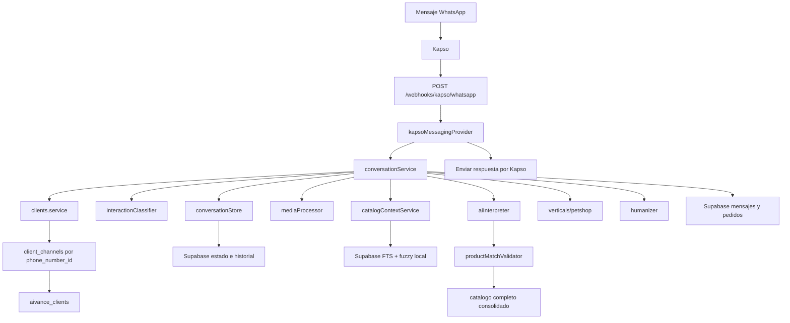

# Contexto Tecnico Vigente

Ultima revision: 2026-06-16.

Este documento es la fuente canonica para entender el codigo actual. Los detalles operativos de Kapso viven en `docs/kapso-migration.md`; los pasos para alta de clientes viven en `docs/aivance-multiempresa.md`.

## Objetivo

Construir un asesor conversacional de WhatsApp para clientes de la plataforma AIVANCE. Distrifinca es el primer cliente configurado y usa la vertical `petshop`.

La autonomia esta separada deliberadamente:

- OpenAI interpreta intencion, lenguaje informal, errores, imagenes y audio.
- El backend valida catalogo, precios, presentaciones, carrito, entrega y confirmacion.
- Supabase conserva clientes, canales, catalogo, estado conversacional, mensajes, pedidos y ejemplos.

## Flujo Principal



1. Kapso envia `whatsapp.message.received`.
2. `src/app.js` valida `x-webhook-signature` contra el cuerpo HTTP crudo y responde `200 OK` rapido.
3. `kapsoMessagingProvider` normaliza texto, multimedia, ids, `phone_number_id` e idempotencia.
4. El buffer agrupa mensajes consecutivos del mismo usuario antes de llamar al agente.
5. `clients.service` busca `client_channels` por `provider='kapso'`, `channel='whatsapp'` y `phone_number_id`.
6. El cliente activo en `aivance_clients` define `vertical`, prompts, reglas y catalogo.
7. `interactionClassifier` decide perfil, historial, ejemplos, modelos y necesidad de catalogo.
8. `mediaProcessor` descarga imagenes o audios cuando Kapso entrega URL.
9. `catalogContextService` recupera candidatos compactos; el catalogo completo sigue disponible para validar.
10. `aiInterpreter` devuelve JSON estructurado.
11. `productMatchValidator` verifica la interpretacion contra catalogo consolidado.
12. La vertical `petshop` aplica cambios reales al carrito, entrega, pago y pedido.
13. `humanizer` mejora tono sin cambiar hechos operativos.
14. Estado, mensajes y pedidos se guardan con `client_id`.
15. Kapso envia la respuesta usando `KAPSO_PHONE_NUMBER_ID` o el `phoneNumberId` del evento.

## Capas Principales

| Archivo | Responsabilidad |
| --- | --- |
| `src/app.js` | Rutas HTTP, firma del webhook, respuesta rapida, idempotencia y cola por usuario. |
| `src/providers/kapsoMessagingProvider.js` | Entrada/salida Kapso, normalizacion de payloads, multimedia y envio de texto. |
| `src/services/clients.service.js` | Resolucion de cliente por canal, prompts y reglas. |
| `src/services/conversationService.js` | Orquestacion general del turno conversacional. |
| `src/services/interactionClassifier.js` | Clasificacion de intencion, perfil de costo, historial y modelos. |
| `src/services/mediaProcessor.js` | Descarga, validacion y envio de imagen/audio a OpenAI. |
| `src/services/catalogContextService.js` | Candidatos compactos por FTS/RPC y fuzzy local. |
| `src/services/catalogConsolidationService.js` | Agrupacion dinamica de typos, aliases y presentaciones equivalentes. |
| `src/services/productMatchValidator.js` | Validacion final de productos contra catalogo completo. |
| `src/services/pendingProductMatchService.js` | Selecciones y coincidencias pendientes entre turnos. |
| `src/services/aiInterpreter.js` | Lenguaje libre a JSON estructurado. |
| `src/services/humanizer.js` | Redaccion natural protegida. |
| `src/conversation/conversationStore.js` | Estado conversacional en memoria con persistencia Supabase. |
| `src/repositories/*` | Acceso a Supabase para catalogo, mensajes, pedidos y ejemplos. |
| `src/verticals/index.js` | Seleccion de vertical por `aivance_clients.vertical`. |
| `src/verticals/petshop/*` | Motor comercial, prompt, barreras y utilidades petshop. |

## Multiempresa

AIVANCE es la plataforma. Cada empresa cliente vive en `aivance_clients`; cada canal WhatsApp vive en `client_channels`.

Reglas vigentes:

- En produccion, el cliente se identifica por `phone_number_id`.
- `client_channels` debe tener una fila activa para cada numero Kapso operativo.
- `aivance_clients.vertical` define el tipo de negocio.
- Distrifinca usa `slug='distrifinca'` y `vertical='petshop'`.
- No se crean carpetas por cliente.
- No se cambia codigo para agregar otra empresa de la misma vertical.
- `CLIENT_SLUG` y `CLIENT_NAME` no forman parte de la configuracion operativa.
- `KAPSO_SANDBOX_CLIENT_SLUG` solo sirve como respaldo local fuera de produccion mientras se registra el canal.

## Catalogo

La fuente de verdad operativa vive en Supabase:

- `catalog_brands`
- `catalog_references`
- `catalog_presentations`

`productos.json` es formato de importacion masiva, no fuente de lectura normal del agente.

Flujo:

```text
Excel o fuente externa -> JSON compatible -> npm run catalog:import -> Supabase
```

Reglas:

- El catalogo de Supabase manda sobre cualquier interpretacion de IA.
- Toda importacion exige `--client` y `--client-name`.
- Busqueda considera nombre, descripcion, aliases, `metadata.original_names`, referencias equivalentes, especie, etapa, categoria y presentaciones.
- FTS/RPC en Supabase se combina con candidatos fuzzy locales.
- La consolidacion dinamica une typos compatibles sin reglas quemadas por producto.
- Una presentacion pedida debe existir exactamente en el catalogo consolidado.
- El catalogo aun no maneja inventario real.

## Estado Conversacional

El estado conserva informacion estructurada, por ejemplo:

```js
{
  ultimaSeleccion: null,
  productosConsultados: [],
  productosPendientes: [],
  referenciasPendientes: null,
  carrito: [],
  pedidoConfirmado: false,
  datosDomicilio: {},
  entrega: { tipo: null, sede: null },
  metodoPago: null,
  esperandoTipoEntrega: false,
  esperandoMetodoPago: false,
  esperandoDatosDomicilio: false,
  esperandoConfirmacionRepetirPedido: false
}
```

Las referencias cortas como `ese`, `el primero`, `de 4kg` o `asi esta bien` deben resolverse primero desde estado estructurado y solo despues desde historial textual.

## Supabase

Tablas principales:

| Tabla | Uso |
| --- | --- |
| `aivance_clients` | Empresas cliente de AIVANCE. |
| `client_channels` | Canales por empresa, incluyendo Kapso WhatsApp. |
| `client_prompts` | Instrucciones adicionales por cliente. |
| `client_delivery_rules` | Reglas y fletes por cliente. |
| `catalog_brands` | Marcas por cliente. |
| `catalog_references` | Referencias por marca. |
| `catalog_presentations` | Presentaciones y precios. |
| `whatsapp_conversations` | Estado por usuario final y cliente AIVANCE. |
| `whatsapp_messages` | Historial inbound/outbound. |
| `whatsapp_orders` | Pedidos confirmados. |
| `training_examples` | Ejemplos curados globales o por cliente. |

Usa `supabase/schema.sql` para proyectos nuevos. En bases existentes, aplica las migraciones indicadas en `docs/aivance-multiempresa.md`.

## OpenAI

| Componente | Variable | Uso |
| --- | --- | --- |
| Interprete | `OPENAI_INTERPRETER_MODEL` | Convierte mensajes en JSON operativo. |
| Vision | `OPENAI_VISION_MODEL` | Extrae senales de imagenes. |
| Humanizador | `OPENAI_MODEL` / `OPENAI_HUMANIZER_MODEL` | Redacta respuesta final. |
| Voz | `OPENAI_TRANSCRIPTION_MODEL` | Transcribe audio descargable. |
| Voz fallback | `OPENAI_TRANSCRIPTION_FALLBACK_MODEL` | Respaldo si falla el transcriptor principal. |

Los modelos GPT-5 se invocan sin `temperature` cuando solo aceptan el valor predeterminado.

## Contexto y Costos

Antes de llamar a OpenAI, el sistema decide cuanto contexto enviar:

- `simple`: sin historial ni catalogo cuando no hacen falta.
- `producto`: candidatos compactos y estado pendiente; historial solo como fallback breve.
- `pedido`: carrito, datos operativos e historial reciente limitado.
- `multimedia`: imagen sin arrastrar foco de una foto previa; audio con contexto reciente limitado.
- `complejo`: contexto ampliado dentro del presupuesto.

Los candidatos enviados al interprete omiten ids internos, metadata extensa, timestamps y stock interno. El humanizador no recibe historial completo ni ejemplos salvo que el flujo lo requiera.

La auditoria detallada vive en `docs/context-audit.md`.

## Variables De Entorno

Grupos principales:

- Servidor: `PORT`, `NODE_ENV`.
- Kapso: `KAPSO_API_KEY`, `KAPSO_PHONE_NUMBER_ID`, `KAPSO_WEBHOOK_SECRET`, `KAPSO_API_BASE_URL`, `META_GRAPH_VERSION`.
- Supabase: `SUPABASE_URL`, `SUPABASE_SECRET_KEY` y nombres de tablas si se personalizan.
- OpenAI: llaves, modelos, timeouts y banderas de IA.
- Multimedia: `MEDIA_DOWNLOAD_TIMEOUT_MS`, `MEDIA_MAX_BYTES`.
- Buffer: `INBOUND_MESSAGE_BUFFER_MS`.
- Cliente: `CLIENT_CACHE_MS`.
- Catalogo/contexto: limites de candidatos, thresholds de matching y logs diagnosticos.

Variables operativas frecuentes:

- `KAPSO_PHONE_NUMBER_ID`: numero Kapso usado para enviar respuestas.
- `KAPSO_WEBHOOK_SECRET`: secreto HMAC; obligatorio en produccion.
- `KAPSO_SANDBOX_CLIENT_SLUG`: respaldo solo para pruebas locales fuera de produccion.
- `CATALOG_CONTEXT_MAX_REFERENCES`: maximo de candidatos de texto.
- `VISION_CATALOG_CONTEXT_MAX_REFERENCES`: maximo de candidatos de vision.
- `AI_VISION_REFINEMENT`: desactiva la segunda lectura visual con `false`.
- `SUPABASE_CATALOG_SEARCH_RPC`: RPC de busqueda, por defecto `search_catalog_products`.
- `CATALOG_SEARCH_BACKEND=local`: fuerza fallback local temporal.
- `AI_CONTEXT_LOGS`, `AI_CONTEXT_PAYLOAD_LOGS`, `PRODUCT_CONTEXT_LOGS`, `AI_USAGE_LOGS`: diagnostico; no dejarlos activos en produccion si exponen datos.

No expongas `SUPABASE_SECRET_KEY`, `SUPABASE_SERVICE_ROLE_KEY`, `KAPSO_API_KEY` ni `OPENAI_API_KEY`.

## Pruebas

Ejecuta:

```bash
npm test
```

Cobertura esperada:

- Resolucion multiempresa por canal Kapso.
- Firma HMAC e idempotencia basica.
- Normalizacion de texto, imagen y audio.
- Buffer de mensajes consecutivos.
- Importacion de catalogo por cliente.
- Busqueda hibrida FTS/fuzzy.
- Consolidacion dinamica de catalogo.
- Matching por aliases y nombres originales.
- Barreras de presentaciones inexistentes.
- Cotizaciones sin agregar al carrito.
- Continuidad por estado y selecciones pendientes.
- Humanizacion sin alterar hechos operativos.

Diagnostico de contexto sin enviar mensajes:

```bash
npm run ai:diagnose -- "tienes br adulto r pequena?"
```

Con llamadas reales a OpenAI:

```bash
npm run ai:diagnose -- --live "tienes br adulto r pequena?"
```

## Supabase SQL

- `supabase/schema.sql`: esquema completo para proyectos nuevos.
- `supabase/002_conversation_orders.sql`: pedidos historicos.
- `supabase/003_training_examples.sql`: ejemplos curados.
- `supabase/004_multiempresa_catalog.sql`: multiempresa y catalogo para bases existentes.
- `supabase/005_catalog_search_rpc.sql`: FTS/trigram/RPC por cliente.
- `supabase/005_petshop_product_classification.sql`: clasificacion comercial petshop.

## Notas De Compatibilidad

No hay flujo Twilio activo. El endpoint conversacional vigente es `POST /webhooks/kapso/whatsapp`.
