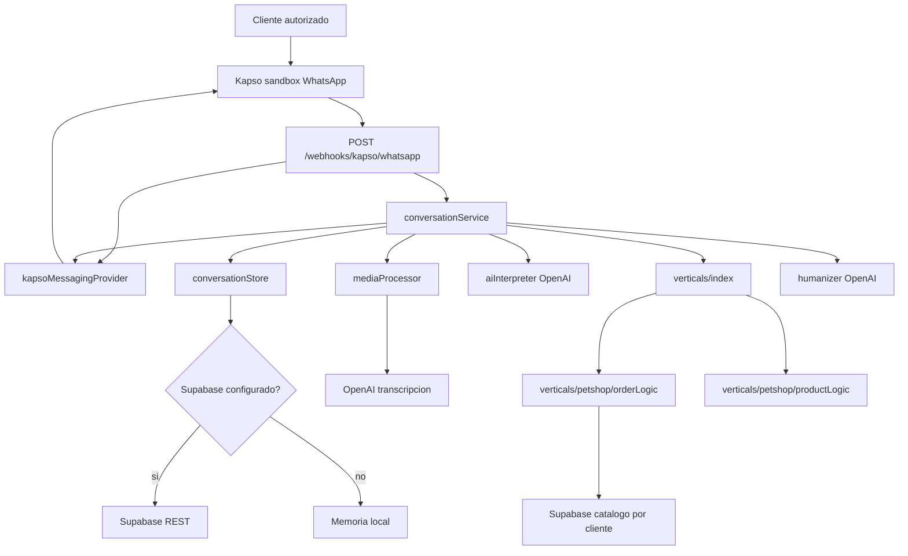

# Contexto tecnico vigente

Fecha de corte: 2026-06-03.

Este documento es el relevo tecnico para continuar el proyecto o iniciar una version nueva sin depender de conversaciones anteriores. Describe el codigo actual. Twilio fue retirado del flujo activo y Kapso es el proveedor de WhatsApp.

## Objetivo

Construir un asesor conversacional de WhatsApp para clientes de la plataforma AIVANCE. Distrifinca es el primer cliente configurado. Debe comprender como escribe realmente un cliente, ayudar a cotizar o comprar, recomendar productos y completar un pedido sin sonar como un formulario rigido.

La autonomia tiene un limite deliberado:

- OpenAI interpreta intencion, contexto, errores de escritura, razas, abreviaturas e imagenes.
- El backend decide si un producto existe y valida marcas, referencias, presentaciones, precios y cambios del carrito.
- Supabase conserva estado, historial, pedidos y ejemplos curados.

## Arquitectura actual



### Separacion por capas

| Archivo | Responsabilidad |
| --- | --- |
| `src/app.js` | Rutas HTTP, firma del webhook, respuesta rapida e idempotencia basica. |
| `src/providers/kapsoMessagingProvider.js` | Entrada y salida especificas de Kapso. Normaliza JSON, multimedia y envio de texto. |
| `src/services/conversationService.js` | Orquesta multimedia, cliente, estado, ejemplos, OpenAI, motor comercial y persistencia. |
| `src/services/mediaProcessor.js` | Entrega URL de imagen a vision y transcribe audio cuando hace falta. |
| `src/services/aiInterpreter.js` | Convierte lenguaje libre en JSON estructurado para el motor. |
| `src/verticals/petshop/orderLogic.js` | Valida catalogo petshop y aplica operaciones reales sobre carrito, entrega y pago. |
| `src/verticals/index.js` | Selecciona la logica vertical segun `aivance_clients.vertical`. |
| `src/services/humanizer.js` | Convierte la respuesta operativa en texto natural sin cambiar hechos. |
| `src/verticals/petshop/productLogic.js` | Ultima barrera petshop ante afirmaciones de presentaciones inexistentes. |
| `src/services/clients.service.js` | Resuelve el cliente por canal Kapso, carga configuracion, prompts y reglas desde Supabase. |
| `src/conversation/conversationStore.js` | Estado conversacional en memoria y persistencia delegada a Supabase. |
| `src/repositories/*` | Catalogo, conversaciones, pedidos y ejemplos curados. |

Para cambiar de proveedor de mensajeria, crea otro adaptador equivalente a `kapsoMessagingProvider.js` y cambia la importacion del provider en `src/app.js`. El resto del flujo no debe conocer detalles del proveedor.

## Flujo de un mensaje

1. Kapso envia un evento `whatsapp.message.received`.
2. `src/app.js` valida `x-webhook-signature` contra el cuerpo HTTP crudo, extrae eventos y responde HTTP `200 OK` inmediatamente.
3. El provider normaliza cliente, destinatario, texto, `phone_number_id`, idempotencia y multimedia.
4. La app agrupa los mensajes consecutivos del mismo cliente y reinicia una espera corta con cada entrada para procesar un solo lote.
5. `conversationService` resuelve el cliente AIVANCE por `phone_number_id` consultando `client_channels` y `aivance_clients`.
6. `conversationService` lee `aivance_clients.vertical` como tipo de negocio y carga la vertical correspondiente.
7. `conversationService` carga el estado y el historial reciente del usuario desde Supabase antes de llamar a OpenAI.
8. Si hay audio, reutiliza la transcripcion de Kapso o descarga el archivo y lo envia a OpenAI para transcripcion.
9. Si hay imagen, pasa la URL publica al interprete OpenAI con capacidades de vision.
10. El interprete devuelve JSON con intencion, accion, productos, entrega, datos del cliente y operacion de carrito.
11. La vertical petshop valida contra el catalogo cargado desde Supabase para el cliente resuelto y modifica el estado solamente cuando corresponde.
12. `humanizer` mejora el tono sin alterar precios, pesos, cantidades ni acciones.
13. La barrera de catalogo de la vertical bloquea una afirmacion incompatible con el catalogo.
14. El estado, el historial y un pedido confirmado se guardan en Supabase con `client_id`.
15. El provider envia la respuesta por Kapso.

## Mejoras ya implementadas

### Criterio comercial

- Una consulta de precio no agrega productos al carrito.
- Una cotizacion puede incluir uno o varios productos.
- Los productos cotizados quedan en `productosConsultados` para entender frases posteriores como `agrega los dos` o `dejame el primero`.
- Un cliente puede pedir varios productos en el mismo mensaje, incluso en varias lineas.
- Una presentacion inexistente produce una negativa util con opciones reales.
- `asi esta bien` avanza al siguiente paso si el carrito ya esta definido; no repite presentaciones.
- El resumen final solicita confirmacion explicita. El humanizador no puede declarar despacho ni confirmacion antes del `si` del cliente.
- Respuestas afirmativas como `perfecto` confirman el resumen final. Si el cliente acepta reutilizar direccion y datos completos de un pedido anterior, no se solicita una confirmacion adicional.
- El ultimo pedido confirmado se conserva como memoria historica separada.
- Un saludo posterior permite ofrecer repetir productos y direccion del ultimo pedido.
- Si el cliente menciona un producto nuevo, el carrito anterior no se mezcla; solo se reutilizan los datos de entrega que no cambien.

### Comprension del cliente

- Tolera abreviaturas como `a.r.p`, `a.r.g`, `cach`, `kl` y errores leves de marca.
- OpenAI puede inferir especie, etapa y tamano desde una raza sin una tabla programada raza por raza.
- Distingue direccion completa de sector o referencia parcial.
- Conserva el hilo si el cliente envia aclaraciones cortas.
- Usa el estado pendiente para interpretar confirmaciones breves con errores ortograficos sin reemplazar datos del cliente.

### Multimedia

- Imagen: Kapso debe entregar una URL real; el backend descarga el archivo y OpenAI recibe `image_url` como data URL/base64 junto con el caption si existe.
- Audio/nota de voz: si hay URL, el backend descarga el archivo y lo envia a OpenAI Whisper.
- `message.kapso.transcript.text` solo se usa como respaldo cuando no hay URL descargable; en ese caso se deja warning porque OpenAI no recibio el audio real.
- La descarga multimedia valida URL publica y aplica timeout y limite de bytes configurables.

### Seguridad y resiliencia inicial

- Firma HMAC SHA-256 sobre el cuerpo HTTP crudo para webhooks Kapso.
- Firma obligatoria en `NODE_ENV=production`.
- Dedupe basico en memoria mediante `x-idempotency-key`.
- Cola en memoria por cliente para mantener el orden de mensajes consecutivos.
- Respuesta HTTP rapida para evitar que el webhook espere el procesamiento completo.
- Supabase es obligatorio para resolver cliente y catalogo.
- Si OpenAI falla, el backend conserva la respuesta operativa validada por catalogo.

## Plataforma y multiempresa

AIVANCE es la plataforma propietaria del software. Los clientes de la plataforma viven en `aivance_clients`; Distrifinca queda registrado con `slug = distrifinca`. Conversaciones, mensajes, pedidos, canales y catalogo se relacionan con `client_id`.

Resolucion de cliente:

- En produccion, el cliente se identifica por el canal entrante: `provider=kapso`, `channel=whatsapp`, `phone_number_id`.
- `phone_number_id` se busca en `client_channels` y de ahi se carga el cliente activo en `aivance_clients`.
- Fuera de produccion, el sandbox puede resolver temporalmente por `KAPSO_SANDBOX_CLIENT_SLUG` si el `phone_number_id` entrante coincide con `KAPSO_SANDBOX_PHONE_NUMBER_ID` o `KAPSO_PHONE_NUMBER_ID`.
- `aivance_clients.vertical` define la vertical o tipo de negocio. Distrifinca usa `petshop`.
- No se cambia `.env` para agregar clientes.
- `CLIENT_SLUG` y `CLIENT_NAME` no forman parte del `.env` operativo.
- Prompts/reglas por cliente viven en `client_prompts` y `client_delivery_rules`.

## Catalogo

La fuente de verdad operativa vive en Supabase, en tablas normalizadas por cliente:

- `catalog_brands`
- `catalog_references`
- `catalog_presentations`

`productos.json` se conserva como formato de importacion masiva, no como fuente del agente. Actualmente contiene el catalogo inicial de Distrifinca:

- Dog Chow: 4 referencias.
- Chunky: 7 referencias.
- Presentaciones y precios por referencia.
- Productos para perro y una referencia Chunky para gato.

Estructura esperada:

```json
[
  {
    "marca": "Dog Chow",
    "referencias": [
      {
        "nombre": "Adulto Mediano y Grande",
        "especie": "perro",
        "descripcion": "Para perros adultos medianos y grandes",
        "presentaciones": [
          { "peso": "1kg", "precio": 20000 }
        ]
      }
    ]
  }
]
```

Flujo de carga:

```text
Excel -> JSON compatible con productos.json -> npm run catalog:import -> Supabase
```

Reglas:

- El catalogo de Supabase manda sobre la IA.
- Una presentacion pedida debe coincidir exactamente con una presentacion disponible.
- Un cambio en Supabase se lee en la siguiente solicitud; no requiere reiniciar el servidor.
- El catalogo aun no maneja inventario real.

## Estado conversacional

El estado conserva, entre otros:

```js
{
  marca: null,
  criterios: {},
  ultimaSeleccion: null,
  productosConsultados: [],
  productosPendientes: [],
  referenciasPendientes: null,
  carrito: [],
  pedidoConfirmado: false,
  datosDomicilio: {},
  entrega: { tipo: null, sede: null },
  metodoPago: null,
  esperandoTipoEntrega: false,
  esperandoMetodoPago: false,
  esperandoDatosDomicilio: false,
  esperandoConfirmacionRepetirPedido: false
}
```

El objeto real contiene banderas adicionales para continuar flujos de recogida, cambio de direccion, datos previos y recomendaciones.

## Supabase

El proyecto usa REST API con una llave secreta exclusiva del backend. Ejecuta `supabase/schema.sql` en un proyecto nuevo.

| Tabla | Uso |
| --- | --- |
| `aivance_clients` | Empresas cliente de la plataforma AIVANCE. |
| `client_channels` | Canales por cliente, por ejemplo Kapso WhatsApp. |
| `client_prompts` | Instrucciones adicionales por cliente para interprete o humanizador. |
| `client_delivery_rules` | Reglas/fletes por cliente expresados como JSON simple. |
| `catalog_brands` | Marcas por cliente. |
| `catalog_references` | Referencias por marca. |
| `catalog_presentations` | Presentaciones y precios por referencia. |
| `whatsapp_conversations` | Una fila por cliente final de WhatsApp y empresa AIVANCE. |
| `whatsapp_messages` | Historial inbound y outbound por empresa. |
| `whatsapp_orders` | Snapshot de pedidos confirmados por empresa. |
| `training_examples` | Ejemplos curados globales o por empresa. |

No expongas `SUPABASE_SECRET_KEY` ni `SUPABASE_SERVICE_ROLE_KEY` en frontend.

## OpenAI

Usos separados:

| Componente | Variable | Proposito |
| --- | --- | --- |
| Interprete | `OPENAI_INTERPRETER_MODEL` | Convierte texto en JSON estructurado. |
| Vision | `OPENAI_VISION_MODEL` | Interpreta imagenes reales con alto detalle y las cruza contra el catalogo. |
| Humanizador | `OPENAI_MODEL` | Redacta la respuesta final con tono natural. |
| Voz | `OPENAI_TRANSCRIPTION_MODEL` | Transcribe audio cuando Kapso no lo hizo. |
| Voz fallback | `OPENAI_TRANSCRIPTION_FALLBACK_MODEL` | Modelo alterno si falla el transcriptor principal. |

Para imagenes, el agente usa `OPENAI_VISION_MODEL` si esta configurado; si no, cae a `OPENAI_INTERPRETER_MODEL`. Para audio, `OPENAI_TRANSCRIPTION_MODEL` permite usar modelos de transcripcion como `gpt-4o-mini-transcribe`; si falla, intenta `OPENAI_TRANSCRIPTION_FALLBACK_MODEL` y luego usa el transcript de Kapso si venia disponible.

Los modelos GPT-5 se invocan sin `temperature`, porque esos modelos pueden aceptar solamente el valor predeterminado. Para modelos anteriores, el interprete permite `OPENAI_INTERPRETER_TEMPERATURE`.

## Variables de entorno

Usa `.env` como archivo unico de configuracion local. Grupos principales:

- Servidor: `PORT`, `NODE_ENV`.
- OpenAI: llave, modelos, timeout y banderas de activacion.
- Kapso: API key, Phone Number ID, secreto del webhook y URL base.
- Supabase: URL, llave secreta, cache de clientes y nombres de tablas.

El `KAPSO_PHONE_NUMBER_ID` se conserva para enviar respuestas por el numero configurado y para pruebas locales, pero la propiedad multiempresa vive en `client_channels`.

## Pruebas

Ejecuta:

```bash
npm test
```

Al corte de este documento existen 24 pruebas automatizadas para:

- Presentacion inexistente y barrera final de catalogo.
- Avance correcto despues de `asi esta bien`.
- Apertura de pedido sin falso positivo de marca.
- Recomendacion contextual por raza.
- Varios productos en un mensaje.
- Cotizacion sin agregar al carrito.
- Agregar productos consultados posteriormente.
- Normalizacion de texto, imagen y audio Kapso.
- Firma HMAC.
- URL de imagen y reutilizacion de transcripcion.

## Archivos de Supabase

- `supabase/schema.sql`: esquema completo multiempresa para proyectos nuevos.
- `supabase/002_conversation_orders.sql`: migracion historica de pedidos.
- `supabase/003_training_examples.sql`: migracion historica de ejemplos.
- `supabase/004_multiempresa_catalog.sql`: migracion de una base existente hacia clientes AIVANCE y catalogo en Supabase.

Para un proyecto nuevo basta ejecutar `supabase/schema.sql`.

## Antecedente Twilio

La primera version respondia TwiML desde `POST /whatsapp`. Esa capa fue eliminada. No recrees el flujo Twilio en una version nueva salvo que exista una necesidad comercial concreta.

## Continuar En Un Proyecto Nuevo

1. Copia el codigo sin `.env`, `node_modules` ni chats crudos.
2. Ejecuta `npm install`.
3. Revisa y completa `.env`.
4. Crea un proyecto Supabase y ejecuta `supabase/schema.sql`.
5. Completa OpenAI y Supabase en `.env`.
6. Configura primero el sandbox de Kapso siguiendo `docs/kapso-migration.md`.
7. Selecciona solamente el evento `Message received`.
8. Ejecuta `npm test`.
9. Prueba texto, cotizacion, compra, varios productos, imagen y nota de voz desde un celular autorizado.
10. Revisa `docs/known-issues-and-roadmap.md` antes de conectar un numero comercial.
