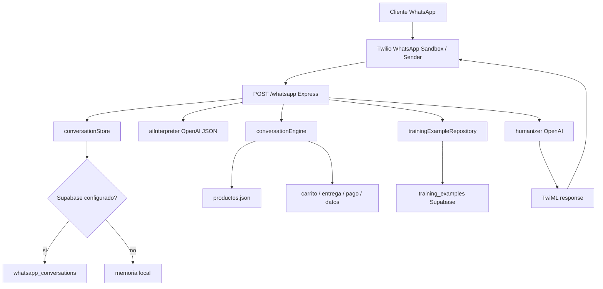

# Contexto completo del proyecto Distrifinca WhatsApp IA

Fecha de corte: 2026-05-28

Este documento resume el estado actual del proyecto para poder iniciar una nueva version sin perder contexto tecnico ni decisiones de producto.

## Objetivo del proyecto

Construir un agente de IA para WhatsApp que atienda clientes de una tienda de mascotas, consulte un catalogo de productos, arme pedidos, gestione carrito, domicilio, recogida, metodo de pago y datos de facturacion.

El agente debe sentirse como un asesor humano: amable, directo, con buen criterio comercial, sin hacer preguntas innecesarias y sin inventar productos, precios ni presentaciones que no existan en el backend.

## Arquitectura

La aplicacion es un servidor Node.js con Express que recibe webhooks de Twilio, procesa el mensaje, consulta estado de conversacion, usa OpenAI para interpretar y humanizar, resuelve reglas de catalogo/carrito contra `productos.json`, persiste en Supabase y responde con TwiML.



### Capas principales

- `src/app.js`: entrada HTTP, orquesta todo el flujo del webhook.
- `src/conversation/conversationEngine.js`: motor principal de catalogo, carrito, entrega, pago, datos y cierre.
- `src/services/aiInterpreter.js`: interpreta semanticamente el mensaje con OpenAI y devuelve JSON estructurado.
- `src/services/humanizer.js`: reescribe respuestas base para sonar mas humano sin cambiar datos criticos.
- `src/conversation/conversationStore.js`: memoria local y persistencia en Supabase.
- `src/repositories/*`: acceso a productos, Supabase y ejemplos de entrenamiento.
- `productos.json`: backend actual de marcas, referencias, especie, presentaciones y precios.
- `supabase/*.sql`: esquema y migraciones.

## Tecnologias utilizadas

- Node.js CommonJS.
- Express `5.2.1`.
- OpenAI SDK `6.38.0`.
- Dotenv `17.4.2`.
- Twilio WhatsApp mediante webhook y respuesta TwiML.
- Supabase via REST API, usando `fetch` nativo de Node.
- PostgreSQL/Supabase con tablas JSONB para estado conversacional.
- Catalogo local en JSON.

## Estructura de carpetas

```text
.
├── server.js
├── package.json
├── productos.json
├── src
│   ├── app.js
│   ├── conversation
│   │   ├── conversationEngine.js
│   │   └── conversationStore.js
│   ├── repositories
│   │   ├── productRepository.js
│   │   ├── supabaseConversationRepository.js
│   │   └── trainingExampleRepository.js
│   └── services
│       ├── aiInterpreter.js
│       ├── humanizer.js
│       └── twiml.js
├── supabase
│   ├── schema.sql
│   ├── 002_conversation_orders.sql
│   └── 003_training_examples.sql
├── scripts
│   └── generate-training-examples.js
├── data
│   └── training_examples
│       ├── generated_training_examples.sql
│       ├── generated_training_examples.json
│       ├── observed_terms.json
│       └── summary.json
└── docs
    ├── training-examples.md
    └── project-context.md
```

## Variables de entorno

El proyecto usa `.env` cargado desde `server.js` con `dotenv`.

No exponer llaves secretas en frontend. La llave de Supabase usada aqui debe vivir solo en backend.

Variables actuales:

```env
PORT=3000

OPENAI_API_KEY=...
OPENAI_MODEL=gpt-4.1-mini
OPENAI_INTERPRETER_MODEL=gpt-4.1-mini
OPENAI_TIMEOUT_MS=7000
AI_INTERPRETER=true
HUMANIZAR_IA=true

SUPABASE_URL=https://TU-PROYECTO.supabase.co
SUPABASE_SECRET_KEY=...
# Alternativa aceptada por el codigo:
SUPABASE_SERVICE_ROLE_KEY=...

SUPABASE_CONVERSATIONS_TABLE=whatsapp_conversations
SUPABASE_MESSAGES_TABLE=whatsapp_messages
SUPABASE_ORDERS_TABLE=whatsapp_orders
SUPABASE_TRAINING_EXAMPLES_TABLE=training_examples
```

Notas:

- `SUPABASE_SECRET_KEY` o `SUPABASE_SERVICE_ROLE_KEY` deben ser llaves secretas de servidor.
- Si no hay Supabase configurado, el sistema funciona con memoria local, pero se pierde al reiniciar.
- Si no hay `OPENAI_API_KEY`, el motor funciona sin interpretacion ni humanizacion IA.
- `AI_INTERPRETER=false` desactiva el interprete semantico.
- `HUMANIZAR_IA=false` desactiva la reescritura humana.

## Catalogo actual

El catalogo vive en `productos.json`.

Estructura esperada:

```json
[
  {
    "marca": "Dog Chow",
    "referencias": [
      {
        "nombre": "Adulto Mediano y Grande",
        "especie": "perro",
        "descripcion": "Para perros adultos medianos y grandes",
        "imagen": "https://...",
        "presentaciones": [
          { "peso": "1kg", "precio": 20000 }
        ]
      }
    ]
  }
]
```

Reglas importantes:

- `marca` agrupa referencias.
- Cada `referencia` debe tener `especie`: `perro` o `gato`.
- Cada referencia tiene sus propias presentaciones y precios.
- Si una presentacion no existe en el JSON, el agente debe decir que no la maneja y mostrar las disponibles.
- No debe sustituir presentaciones. Ejemplo: si el cliente pide `8kg`, no puede ofrecer `22.7kg` como si fuera exacto.

## Flujo de mensajes WhatsApp

1. Twilio envia `POST /whatsapp` con `Body` y `From`.
2. `src/app.js` normaliza el mensaje y carga el estado del usuario.
3. `conversationStore` intenta cargar estado desde Supabase. Si no hay Supabase, usa memoria local.
4. `aiInterpreter` usa OpenAI para devolver una interpretacion JSON:
   - intencion
   - accion
   - producto
   - entrega
   - datosCliente
   - carrito
   - faltante sugerido
5. `conversationEngine` toma la decision operativa:
   - listar marcas
   - listar referencias
   - resolver producto exacto
   - agregar al carrito
   - modificar cantidad
   - mantener solo un producto
   - quitar producto
   - pedir presentacion faltante
   - pedir metodo de pago
   - pedir datos de domicilio
   - confirmar pedido
6. `trainingExampleRepository` carga ejemplos dinamicos desde Supabase para orientar estilo y criterio.
7. `humanizer` reescribe la respuesta base con OpenAI, cuidando no cambiar precios, pesos, cantidades ni acciones criticas.
8. `conversationStore` guarda estado, mensajes inbound/outbound y pedidos confirmados.
9. `twiml.js` responde XML a Twilio.

## Integracion con Twilio

El servidor expone:

```http
POST /whatsapp
Content-Type: application/x-www-form-urlencoded
```

Campos usados:

- `Body`: mensaje del cliente.
- `From`: identificador del usuario/canal, usado como `channel_user_id`.

Respuesta:

```xml
<Response>
  <Message>texto de respuesta</Message>
</Response>
```

Para conectarlo:

1. Ejecutar el servidor: `npm start`.
2. Exponerlo con ngrok u otro tunel.
3. Configurar en Twilio el webhook de WhatsApp a:

```text
https://TU-DOMINIO/whatsapp
```

Problema operativo frecuente:

- Si se hacen cambios y WhatsApp sigue respondiendo igual, casi siempre el proceso conectado a Twilio no fue reiniciado o Twilio/ngrok apunta a otra carpeta/proceso.

## Integracion con OpenAI

Hay dos usos distintos de OpenAI:

### 1. Interprete semantico

Archivo: `src/services/aiInterpreter.js`.

Objetivo: entender el mensaje del cliente y devolver JSON, no responder al cliente.

Modelo:

```js
process.env.OPENAI_INTERPRETER_MODEL || process.env.OPENAI_MODEL || "gpt-4.1-mini"
```

Temperatura:

```js
0.1
```

Salida esperada:

```json
{
  "intencion": "pedido_producto",
  "accion": "agregar",
  "confianza": 0.95,
  "producto": {
    "marca": "Dog Chow",
    "referencia": "Adulto Mini y Pequeño",
    "especie": "perro",
    "etapa": "adulto",
    "tamano": "pequeno",
    "presentacion": "4kg",
    "cantidad": 1
  },
  "entrega": {
    "tipo": "domicilio",
    "direccion": "Cra 10 #26-49 centro",
    "direccionCompleta": true,
    "sector": null,
    "metodoPago": null,
    "sede": null
  },
  "datosCliente": {
    "nombre": null,
    "cedula": null,
    "correo": null,
    "celular": null
  },
  "carrito": {
    "operacion": null,
    "cantidadObjetivo": null,
    "aplicaAlUltimoProducto": false,
    "razon": null
  },
  "faltanteSugerido": null
}
```

Reglas actuales del interprete:

- Entiende abreviaturas como `a.r.g`, `a.r.p`, `a`, `cach`.
- Puede inferir tamano por razas de perro sin una lista hardcodeada.
- Respeta presentaciones exactas escritas por el cliente.
- Interpreta operaciones de carrito: agregar, quitar, mantener solo, modificar cantidad.
- Detecta direccion completa vs sector o direccion parcial.

### 2. Humanizador

Archivo: `src/services/humanizer.js`.

Objetivo: hacer la respuesta mas natural sin cambiar datos del backend.

Modelo:

```js
process.env.OPENAI_MODEL || "gpt-4.1-mini"
```

Temperatura:

```js
0.55
```

Protecciones actuales:

- Conserva lineas que empiezan por `- `.
- Conserva `Precio:` y `Total:`.
- Conserva tokens criticos como precios y pesos.
- No puede convertir una respuesta que ya agrego producto en una pregunta.
- No puede convertir una correccion de carrito en otro agregado.
- Si la respuesta base dice que una presentacion no esta disponible, no se humaniza.
- No se humanizan instrucciones bancarias ni resumen final de datos de domicilio.

## Integracion con Supabase

El acceso a Supabase se hace por REST API, no con SDK.

Archivos:

- `src/repositories/supabaseConversationRepository.js`
- `src/repositories/trainingExampleRepository.js`
- `supabase/schema.sql`
- `supabase/002_conversation_orders.sql`
- `supabase/003_training_examples.sql`

### Tablas

#### `whatsapp_conversations`

Guarda una fila por usuario/canal.

Campos principales:

- `channel_user_id`: identificador de Twilio (`From`).
- `customer`: datos del cliente extraidos del estado.
- `state`: estado completo de la conversacion.
- `status`: estado resumido.
- `last_message`: ultimo mensaje recibido.
- `last_response`: ultima respuesta enviada.
- `last_interaction_at`.

Estados posibles generados por codigo:

- `pedido_confirmado`
- `esperando_datos_domicilio`
- `esperando_metodo_pago`
- `esperando_sede_recogida`
- `pedido_en_proceso`
- `conversacion_abierta`

#### `whatsapp_messages`

Guarda historial de mensajes.

Campos principales:

- `conversation_id`
- `channel_user_id`
- `direction`: `inbound` u `outbound`
- `body`
- `created_at`

#### `whatsapp_orders`

Guarda pedidos confirmados.

Campos principales:

- `conversation_id`
- `channel_user_id`
- `order_key`
- `order_snapshot`
- `total`
- `status`
- `confirmed_at`

`order_snapshot` incluye:

```json
{
  "carrito": [],
  "datosDomicilio": {},
  "entrega": {},
  "metodoPago": "efectivo"
}
```

#### `training_examples`

Guarda ejemplos curados para mejorar tono y criterio.

Campos:

- `intent`
- `customer_message`
- `ideal_response`
- `notes`
- `tags`
- `active`
- `priority`

El repositorio trae hasta 30 ejemplos activos, puntua por coincidencia textual y pasa maximo 4 al humanizador.

## Estado conversacional actual

Estado inicial en `conversationStore.js`:

```js
{
  marca: null,
  criterios: {},
  ultimaSeleccion: null,
  productosPendientes: [],
  referenciasPendientes: null,
  carrito: [],
  pedidoConfirmado: false,
  datosDomicilio: {},
  entrega: { tipo: null, sede: null },
  metodoPago: null,
  confirmacionPedidoId: null,
  ultimoPedidoGuardadoKey: null,
  ultimoPedidoGuardadoAt: null,
  pedidoConfirmadoPendienteGuardar: false,
  pedidoNuevoConDatosPrevios: false,
  datosPreviosConfirmados: false,
  esperandoTipoEntrega: false,
  esperandoSedeRecogida: false,
  esperandoMetodoPago: false,
  instruccionesPagoEnviadas: false,
  esperandoDatosDomicilio: false,
  esperandoPresupuesto: false,
  pendienteRecomendacion: false,
  esperandoMarca: false,
  esperandoConfirmacionDomicilio: false,
  esperandoConfirmacionRepetirPedido: false,
  esperandoConfirmacionDatosPrevios: false,
  esperandoCambioDireccion: false,
  esperandoConfirmacionDatosFacturacion: false,
  esperandoActualizacionDatosCliente: false,
  alternativaPendiente: null
}
```

## Funcionalidades terminadas

- Webhook WhatsApp con Twilio.
- Respuesta TwiML.
- Catalogo local por marca, referencia, especie, presentacion y precio.
- Consulta dinamica de marcas por especie.
- Consulta de referencias por marca.
- Filtro por perro/gato, adulto/cachorro, tamano, sabores.
- Interpretacion de abreviaturas comunes.
- Inferencia de razas mediante IA.
- Manejo de presentaciones en kg, kl, kilos, gramos.
- Bloqueo de presentaciones inexistentes.
- Agregar productos al carrito.
- Agregar varios productos en una conversacion.
- Producto incompleto: pregunta solo lo faltante cuando puede.
- Modificar cantidades del carrito.
- Quitar productos.
- Mantener solo un producto.
- Nuevo pedido despues de pedido confirmado.
- Repetir pedido anterior.
- Usar datos previos de domicilio/facturacion.
- Cambiar direccion de envio.
- Domicilio vs recogida.
- Sedes de recogida:
  - `calle 18 # 10 - 40`
  - `carrera 10 # 17-28`
- Metodos de pago:
  - efectivo
  - transferencia bancaria Bancolombia/Davivienda
  - tarjeta debito o credito
  - llave bre-B
- Instrucciones de transferencia:
  - ahorros Bancolombia: Luz Merida Gomez Ospina, nr. 07300007105
  - ahorros Davivienda: nr. 127200128222
  - llave bre-B: `@luzg5604`
- Solicitud de datos de domicilio/facturacion:
  - cedula
  - correo
  - celular
  - direccion
  - nombre
- Confirmacion final con pedido y datos.
- Persistencia de estado en Supabase.
- Historial de mensajes en Supabase.
- Pedidos confirmados en Supabase.
- Ejemplos de entrenamiento curados desde chats exportados.
- Protecciones para que la IA no invente precios/pesos ni cambie acciones criticas.

## Funcionalidades pendientes

- Base de datos para productos en Supabase, reemplazando `productos.json`.
- Panel administrativo para crear marcas, referencias, especies, presentaciones, precios e imagenes.
- Migracion de catalogo local a tablas relacionales.
- Integracion con software de facturacion.
- Manejo de stock real y disponibilidad.
- Debounce o espera de varios mensajes seguidos del cliente antes de responder.
- Interpretacion de imagenes:
  - productos enviados por foto
  - referencias desde foto
  - comprobantes de transferencia
- Manejo avanzado de comprobantes de pago.
- Validacion real de pagos por transferencia.
- Tests automatizados de conversaciones.
- Suite de regresion con casos reales de WhatsApp.
- Observabilidad: logs estructurados, trazas por conversacion, dashboard de errores.
- Cola de trabajos para evitar respuestas duplicadas si Twilio reintenta.
- Autenticacion/seguridad para endpoints administrativos futuros.
- RLS/policies mas finas si se expone algun frontend.
- Separar aun mas reglas de negocio y prompts para facilitar mantenimiento.

## Problemas conocidos

- Aun existe bastante logica local en `conversationEngine.js`; el objetivo futuro es mover mas razonamiento a herramientas/prompt y dejar el motor como validador de backend.
- El catalogo en JSON obliga a reiniciar si se cambian productos.
- No existe debounce: si el cliente envia varios mensajes seguidos, el bot puede responder antes de entender la intencion completa.
- La humanizacion con IA puede introducir riesgo si no se protege una respuesta critica. Ya hay validaciones, pero se debe seguir probando.
- Si Twilio responde con comportamiento viejo despues de un cambio, probablemente el proceso no fue reiniciado o el webhook apunta a otro proceso/tunel.
- La direccion parcial puede ser dificil de detectar en frases ambiguas. Ejemplo: barrio, conjunto sin torre/casa, o direccion incompleta.
- La tabla `whatsapp_conversations` todavia guarda `last_message` y `last_response`; el usuario indico que no son prioritarios, pero siguen existiendo por compatibilidad.
- El sistema usa service/secret key de Supabase en backend. Nunca debe moverse a frontend.
- No hay pruebas unitarias ni e2e automatizadas.
- No hay control de concurrencia fuerte si el mismo usuario envia mensajes simultaneos.
- Los ejemplos de entrenamiento son orientativos, no fine-tuning. Se usan como contexto dinamico en prompts.

## Comandos utiles

Instalar dependencias:

```bash
npm install
```

Ejecutar servidor:

```bash
npm start
```

Verificar sintaxis:

```bash
node -c server.js
node -c src/app.js
node -c src/conversation/conversationEngine.js
node -c src/services/aiInterpreter.js
node -c src/services/humanizer.js
```

Procesar chats exportados de WhatsApp:

```bash
node scripts/generate-training-examples.js /Users/gomez/Downloads/Examples_chats data/training_examples
```

## Como levantar un nuevo proyecto desde este contexto

1. Crear un servidor Express con `POST /whatsapp`.
2. Mantener separadas estas capas:
   - entrada Twilio
   - memoria conversacional
   - interprete IA JSON
   - motor de negocio/catalogo
   - humanizador IA
   - persistencia
3. Migrar `productos.json` a base de datos cuando el catalogo crezca.
4. Mantener al backend como fuente de verdad de productos, precios y presentaciones.
5. Usar OpenAI para interpretar lenguaje humano, no para inventar disponibilidad.
6. Validar siempre contra catalogo antes de agregar al carrito.
7. Guardar estado por `channel_user_id`.
8. Guardar pedidos confirmados como snapshots inmutables.
9. Agregar debounce antes de responder a WhatsApp.
10. Crear pruebas conversacionales con los casos que ya fallaron.

## Casos criticos que deben probarse siempre

- Cliente pide marca y referencia exacta con presentacion existente.
- Cliente pide presentacion inexistente.
- Cliente pide dos productos, uno incompleto y otro completo.
- Cliente dice `solo este producto`.
- Cliente dice `solamente es 1 paquete`.
- Cliente elimina un producto.
- Cliente cambia direccion despues de confirmar.
- Cliente hace otro pedido despues de uno confirmado.
- Cliente pide el mismo pedido anterior.
- Cliente da direccion parcial.
- Cliente da direccion completa.
- Cliente pregunta por gato adulto pero solo hay gatito.
- Cliente pregunta por especie sin marca.
- Cliente pide recomendacion con presupuesto.
- Cliente pide recomendacion sin presupuesto.
- Cliente agradece despues de confirmar.

## Nota final

La direccion del proyecto es clara: el agente debe razonar como asesor humano, pero el backend debe seguir siendo la autoridad. La IA puede interpretar lenguaje, abreviaturas, razas, contexto y tono; el sistema debe validar disponibilidad, precios, cantidades y pedidos antes de responder o guardar.
